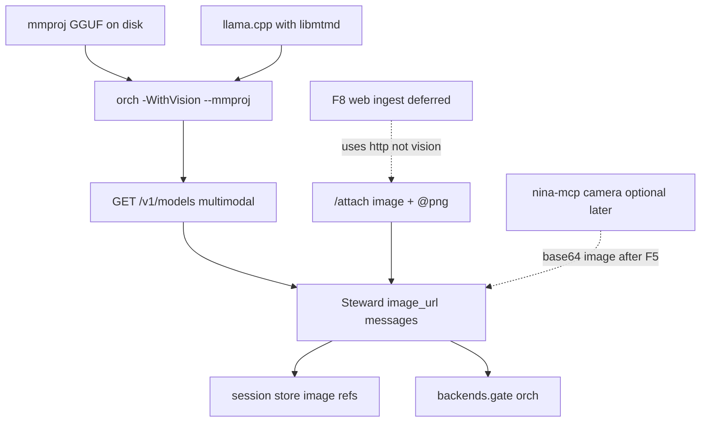

# F5 Vision — dependencies, starting conditions, implementation

## Scope decision (fixed)

**This cycle implements F5 only** (Qwythos + mmproj on orchestrator). Web/browser automation is **F8** (documented below with its own gates), not mixed into F5: `http` is text-only today; Playwright/browser MCP would add a second tool surface and VRAM/concurrency pressure on the same orch lane.

Atomic lane stays **text-only** (no mmproj on `:11439`).

---

## Dependency map



| Layer | Dependency | Status today |
|-------|------------|--------------|
| Weights | `models/mmproj-Qwythos-9B-Claude-Mythos-5-1M-F16.gguf` (~876 MB) + text GGUF | **Present** |
| Host scripts | [`_common.ps1`](C:/Users/soyko/Documents/Ollama/docker/llamacpp/_common.ps1) `Add-QwythosMmprojArgs`; [`start-qwythos-server.ps1`](C:/Users/soyko/Documents/Ollama/docker/llamacpp/start-qwythos-server.ps1) `-WithVision` | **Ready, off by default** |
| VRAM | Extra ~0.9 GB F16 projector on orch GPU(s) | Operator must free headroom |
| llama.cpp | Build with mtmd / multimodal server support | Assumed from current stack; verify at probe |
| Steward client | Typed `content[]` with `image_url` | **Missing** |
| Attach path | [`_read_attachment`](core/runtime.py) text-only | **Must extend** |
| Session JSON | String `content` only | **Must allow structured content or path refs** |
| Backend gate | Orch semaphore ([`core/backend_gate.py`](core/backend_gate.py)) | Already serializes orch; vision uses same lane; **no** slot/KV logic |
| llama.cpp slots/KV | Server: longest-prefix + LRU + `--cache-ram` / `--cache-idle-slots`; unified KV in recent builds | **Host-owned**; see appendix — do not reimplement |
| Atomic / dream | No mmproj | Do not send images to atomic |
| nina-mcp camera | Can return image if `omit_image=false` | Optional consumer **after** F5 client works |
| Web / browser | Separate stack | F8 |

---

## Implementation starting conditions (do not code until green)

All of the following must be true before claiming F5 done; the first three are **hard gates** before writing client code that expects vision:

1. **Weights path exists**  
   `C:\Users\soyko\Documents\Ollama\docker\llamacpp\models\mmproj-Qwythos-9B-Claude-Mythos-5-1M-F16.gguf`

2. **Orchestrator restarted with vision**  
   Example: `.\start-qwythos-server.ps1 -WithVision` (or equivalent that calls `Add-QwythosMmprojArgs`). Confirm process args include `--mmproj` pointing at that file.

3. **Capability probe**  
   `GET http://127.0.0.1:11440/v1/models` (or `/models`) reports multimodal / vision capability for the loaded model. If absent, stop — client must not invent `image_url` traffic against a text-only server.

4. **Smoke outside Steward (recommended once)**  
   One OpenAI-compatible chat with a tiny PNG via `messages[].content` typed parts (`type: image_url`, `data:image/png;base64,...`) returns a sensible description. Documents that the build accepts the wire format Steward will emit ([server README multimodal section](C:/Users/soyko/Documents/Ollama/docker/llamacpp/llama.cpp/tools/server/README.md)).

5. **Operator awareness**  
   Enabling vision is **KV-breaking** vs a text-only orch session (new projector in the server). Prefer a **new Steward session** after flipping `-WithVision`. Do not toggle mid-session.

6. **Operator awareness (LCP / sessions)**  
   Enabling vision is **KV-breaking** vs a text-only orch session (new projector in the server). Prefer a **new Steward session** after flipping `-WithVision`. Do not toggle mid-session. With `--parallel 1` (current orch/atomic), slot/KV recycling quirks below do not bite; they matter when raising `--parallel` later (see appendix).

7. **Non-goals for start**  
   F3 `--parallel`, F4 slot save/restore, F6 font zoom, Playwright, and general browser MCP are **not** required to start F5. Steward must **not** reimplement llama.cpp slot/KV heuristics in [`backend_gate.py`](core/backend_gate.py) — the server already owns that (see appendix).

---

## Appendix — llama.cpp slots, KV cache, and fresh sessions

**Q:** Can llama.cpp assign various slots for serialized “fresh” chat sessions and manage KV cache (e.g. reclaim free space)?

**A:** Yes. This is **server-side** behavior and more sophisticated than anything Steward should build. No F5 client code change; ops notes only for a future `--parallel` bump (F3 / host scripts under `~/Documents/Ollama/docker/llamacpp`).

### Slot selection for fresh sessions (`id_slot=-1`)

Not “first free slot.” When acquiring an idle slot, the server prefers the idle slot whose **cached token history shares the longest common prefix** with the incoming request (maximize LCP / cache hits without manual assignment). If no idle slot has a good prefix match, it falls back to **LRU** (`t_last_used`) — production logs show `selected slot by LRU`.

### KV / prompt-cache recycling

Automatic recycle on LRU eviction:

1. Persist the outgoing prompt into a **RAM prompt-cache** (e.g. ~146 MiB for ~7316 tokens in a real log).
2. Before full recompute, search that cache for a better-matching prompt (`f_keep` = reusable-token ratio).

Relevant binary flags (already in llama-server; defaults are usually on):

| Flag | Role |
|------|------|
| `--cache-ram` | Max RAM for prompt-cache (default often 8192 MiB) |
| `--cache-idle-slots` | Save idle slots into prompt-cache when a new task arrives; clear when using unified KV (default on) |
| `-ctxcp` / `--ctx-checkpoints` | Cap checkpoints per slot |

Recent builds can use a **unified KV buffer** shared across sequences (not a fixed `n_ctx / n_parallel` carve-up), which makes space recycling more flexible than classic per-slot partitioning.

### Caveat (reinforces existing F3 / LCP risk — does not change F5)

Open issue (May 2026): under `-np` / `--parallel` **> 1**, prompt-cache **checkpoints are local to each slot**. If a request with the same prefix lands on a different slot than the one holding the matching checkpoint, the server **misses** and recomputes cold even though a good checkpoint exists on another slot of the same process.

- **`--parallel 1` (current orch + atomic):** irrelevant — only one slot.
- **Future raise of `--parallel`:** same LCP cold-start class of risk already called out for multi-child / multi-session; root cause is per-slot checkpoints, not Steward.

### Implication for `id_slot` policy (host / future profiles)

| Lane | Prefer | Why |
|------|--------|-----|
| **Atomic** | Leave `id_slot=-1` | Server heuristics (longest-prefix → LRU → prompt-cache swap) beat client pinning in [`backend_gate.py`](core/backend_gate.py) for short/fresh delegate jobs |
| **Orchestrator** | Keep a **fixed pin** (e.g. `id_slot=0`) when multi-slot exists | Deterministic long session; never let another request’s best-match steal the orch slot |

Do **not** add slot-assignment logic to Steward for F5. Client gate stays a simple concurrency semaphore.

### Ops note (when you edit llamacpp launch scripts)

If/when atomic (or orch) raises `--parallel N`:

- Set **`--cache-ram`** and **`--cache-idle-slots`** explicitly so recycle behavior does not depend on version-default drift.
- Path of record: `C:\Users\soyko\Documents\Ollama\docker\llamacpp\` (operator-owned; out of Tiny Steward repo).

---

## F5 client design (concrete)

### Wire format

llama.cpp OpenAI chat: user message `content` as array of parts:

```json
[
  {"type": "text", "text": "Describe this."},
  {"type": "image_url", "image_url": {"url": "data:image/png;base64,..."}}
]
```

Prefer **data URIs** (portable; avoids `--media-path` / `file://` host coupling). Cap decoded image size (e.g. 4–8 MB) and optionally downscale large images before encode.

### Ingest UX

- Extend `/attach` and `@path` expansion: if path suffix is image (`.png`, `.jpg`, `.jpeg`, `.gif`, `.webp`, `.bmp`), build multimodal user message instead of text dump.
- Meta: `/image <path>` as alias of image attach (same code path).
- Text attachments keep current behavior ([`ATTACH_MAX_CHARS`](core/runtime.py)).

### LLM / normalize

- [`LLMClient._build_body`](core/llm.py): pass through list-valued `content` unchanged.
- [`normalize_messages_for_llm`](core/runtime.py): scrub/placeholder only on string parts; leave `image_url` parts intact; never strip images when “cleaning” chrome.
- Health: on startup, probe multimodal; set `runtime.vision_enabled`. If user attaches an image while false → clear error (“restart orch with -WithVision”).

### Persistence

- Session store: keep **path + mime + short text caption** in history for reload; re-encode to data URI on the fly when calling the LLM (avoid multi-MB base64 bloating `sessions/*.json`). Cap concurrent images in live context (e.g. last 2 images or 1 per turn).

### Config

```yaml
llm:
  orchestrator:
    # document only; server-side --mmproj is source of truth
    vision: auto   # auto = probe /v1/models; on = require; off = refuse images
```

Do not set `add_vision_id` unless a smoke test shows the chat template needs it (reserved in client already; leave unset by default).

### Tests

- Unit: image path → content parts shape; text path unchanged; normalize preserves image parts; refuse when `vision_enabled=false`.
- No live GPU test required in CI.

### Docs

- [`docs/operator.md`](docs/operator.md): starting conditions checklist + `/image` / attach.
- [`plans/fuera-de-alcance.md`](plans/fuera-de-alcance.md): check off F5 when done.
- Note VRAM + new session after enabling mmproj.

---

## F8 web / browser (deferred — starting conditions only)

Do **not** implement in this cycle. When starting F8 later:

| Gate | Requirement |
|------|-------------|
| Need | Clear product choice: **readable `http` HTML→text** vs **Playwright/browser MCP** |
| Shared | Existing [`http`](core/primitives.py) primitive; orch gate; MEMENTO (write digests to files, don’t paste) |
| Not required for F8 | mmproj / vision |
| Avoid | Wiring policy `.mcp.json` (legal Claude connectors) into Steward’s nina-hardcoded [`mcp`](core/primitives.py) |
| nina-mcp | Astronomy only; camera images feed **F5**, not web |

Recommended F8 MVP later: enhance `http` with optional `Accept`/HTML→plain (stdlib or small dependency), cap size, write to `sessions/.temp/` for `/attach` — still no browser.

---

## Implementation order

1. Confirm starting conditions 1–4 on the host (manual / ops).
2. Probe helper + `vision_enabled` in Steward.
3. Image attach → multimodal message builder + LLM body passthrough.
4. Session path-ref persistence + normalize safety.
5. Tests + operator docs + mark F5 done in backlog.

## Success criteria

- With orch on `-WithVision`, `/image path/to.png` + short question yields a grounded visual answer.
- Without mmproj, attach fails fast with an actionable message.
- Text-only sessions and atomic/dream paths unchanged.
- F3–F4, F6, F8 remain deferred.
- No Steward code for slot selection / KV recycle (server appendix); when raising `--parallel`, pin orch and leave atomic at `id_slot=-1`, and set `--cache-ram` / `--cache-idle-slots` explicitly in host scripts.
