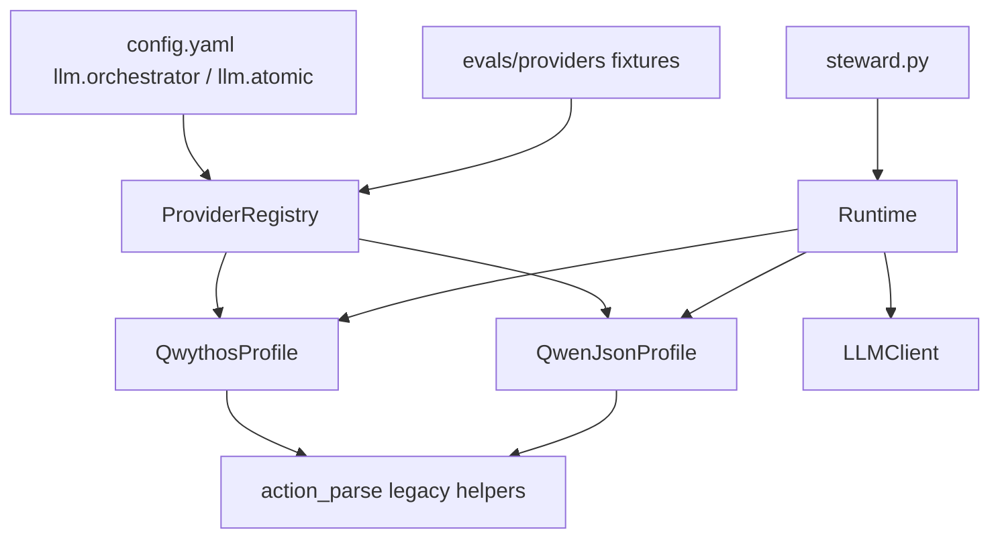

# Provider profiles and runtime split

## Verdict on `runtime_client.py` / `runtime_server.py`

**Do not use those names.** They do not match this codebase.

Verified facts:

- [`core/runtime.py`](core/runtime.py) is **2114 lines** — larger than every other `core/` module combined except `display.py` (682). Next largest logic modules: `llm.py` (422), `primitives.py` (387).
- There is **no app-level client/server split** inside Runtime. HTTP to llama.cpp already lives in [`core/llm.py`](core/llm.py) (`LLMClient`). Runtime is a **local orchestrator**: REPL + tool loop + optional delegate child process ([`steward.py`](steward.py) lines 207–249 set `runtime_llm = atomic_llm` for `--delegate-mode`).
- **No other `core/` module imports Runtime** — only `steward.py` and tests. Splitting is low-risk for package cycles if re-exports stay stable.
- Primary vs secondary is already a **lane flag**, not client/server: `_call_llm(..., backend="primary"|"secondary")` selects `self.llm` vs `self.atomic_llm` ([`core/runtime.py`](core/runtime.py) ~850–863). Tools payload metadata keys are `tools_payload_sent_primary|secondary` (~481–497).

A `*_client` / `*_server` split would invent a false architecture and confuse operators who already read “orchestrator / atomic” in [`config.yaml`](config.yaml) and [`core/README.md`](core/README.md).

**Chosen split (responsibility seams verified by method map):**

| Module | Content (line ranges today) | Approx size |
|--------|-----------------------------|-------------|
| [`core/providers/`](core/providers/) | Profile Protocol, notes, Qwythos + Qwen parsers, registry | new |
| [`core/action_parse.py`](core/action_parse.py) | Shared legacy `<action>`, `PRIMARY_ARGS` mapping helpers used by profiles | ~from 275–339 |
| [`core/runtime_messages.py`](core/runtime_messages.py) | `strip_think_from_text`, `normalize_messages_for_llm` (~226–272) | ~50 |
| [`core/runtime_delegate.py`](core/runtime_delegate.py) | Mixin or helpers: `_run_delegate_loop`, `_delegate_with_terminal`, wait/orphan/child (~1233–1452) | ~220 |
| [`core/runtime_meta.py`](core/runtime_meta.py) | Mixin: `_handle_meta_command`, attach/`@`, dream wrapper, `_handle_set` / config table (~1539–2114) | ~550 |
| [`core/runtime.py`](core/runtime.py) | Facades: `Runtime`, `SYSTEM_PROMPT`, `run_task`, `run_interactive`, `_call_llm`, `_execute_action`, `_process_response_actions` | target **&lt;900** |

Re-export public symbols from `core.runtime` (`extract_actions`, `normalize_messages_for_llm`, `SYSTEM_PROMPT`, …) so existing tests keep importing `from core.runtime import …` without churn in the first PR.



---

## Problem this solves (code-backed)

Today [`extract_actions`](core/runtime.py) (~342–353) **tries every dialect in one function**: Qwen JSON, then Qwythos XML, then legacy `<action>`. That is fine for the current two backends but:

1. Secondary cannot declare a required dialect (ambiguous parses as more providers appear).
2. There is no place for **ops notes**, **template kwargs defaults**, or **eval fixtures** per provider.
3. Runtime remains a monolith mixing parse, REPL meta (~200 lines of `/commands`), `/set` (~180 lines), and delegate spawn.

Qwythos must remain the **default orchestrator profile** with behavior unchanged (XML tool calls + thinking kwargs documented in [`core/README.md`](core/README.md)).

---

## Design: `ProviderProfile`

New package [`core/providers/`](core/providers/):

- `base.py` — `ProviderNotes` dataclass + `ProviderProfile` Protocol:
  - `id`, `lane` (`orch` | `atomic`)
  - `notes`: `template_name`, `tool_call_dialect`, `jinja_required`, `think_tags`, `kv_breaking_keys`, `ops_notes` (string pulled from current README/config comments where possible)
  - `extract_actions(text) -> list[dict]` — **profile-owned** (not try-all)
  - `normalize_outbound(messages, *, preserve_thinking: bool)` — default impl delegates to shared `runtime_messages.normalize_messages_for_llm`
  - `default_template_kwargs() -> dict`
  - `tools_for_request(tools) -> list|None` — passthrough; room for provider-specific shaping later
- `qwythos.py` — move `_parse_qwythos_tool_call` here; fallback to legacy `<action>` only
- `qwen_json.py` — move `_parse_qwen_tool_call` here; fallback to legacy `<action>` only
- `registry.py` — `PROVIDER_REGISTRY = {"qwythos": ..., "qwen3_json": ...}`; `resolve(provider_id) -> ProviderProfile`

**Locked dialect rule:** each profile parses **its** dialect first, then legacy `<action>`. Runtime no longer runs Qwen-then-Qwythos on every turn. Cross-dialect fallback only if we explicitly add a `compat_try_all` debug flag (default **off**).

Wire in Runtime:

```python
self.profiles = {
    "primary": registry.resolve(orch_provider),
    "secondary": registry.resolve(atomic_provider),
}
# ...
actions = self.profiles[backend].extract_actions(response)
```

[`LLMClient.from_lane_config`](core/llm.py) (~84–111) already maps `enable_thinking` / `preserve_thinking` into `chat_template_kwargs`. Extend lane config with:

```yaml
llm:
  orchestrator:
    provider: qwythos          # default; do not change lightly
  atomic:
    provider: qwen3_json       # swappable later without touching Runtime loop
```

Unknown `provider` → clear startup error listing registered ids.

[`steward.py`](steward.py) passes resolved profile ids into `Runtime(...)` (or Runtime resolves from config path already stored as `config_path`).

---

## Refactor sequence (behavior-preserving)

### Phase A — Extract without behavior change

1. Move parse helpers + `extract_actions` into `action_parse.py` / profiles; keep `from core.runtime import extract_actions` as thin re-export.
2. Move `normalize_messages_for_llm` / `strip_think_from_text` into `runtime_messages.py`; re-export.
3. Run existing tests: `test_tool_call_parsing.py`, `test_message_normalization.py`, `test_prompt_hygiene.py`, `test_llm_reasoning.py`, `test_tools_payload_policy.py`, `test_delegate.py`, `test_execute_action_dispatch.py`, `test_rules.py`, `test_attach.py`.

### Phase B — Profiles + config

1. Implement `QwythosProfile` / `QwenJsonProfile` wrapping the moved parsers.
2. Runtime `_call_llm` / `_process_response_actions` / `_run_delegate_loop` call `self.profiles[backend].extract_actions`.
3. Add `provider` to both lanes in [`config.yaml`](config.yaml); document in [`core/README.md`](core/README.md) under the existing chat_template_kwargs section.
4. Profile `notes.ops_notes` encode verified ops constraints already listed in config comments (atomic `--jinja`, `--parallel 1`, ctx budgets) — single source for `/providers` REPL preview (small meta command).

### Phase C — Split Runtime mixins

1. `RuntimeMetaMixin` → `runtime_meta.py` (meta commands + `/set`).
2. `RuntimeDelegateMixin` → `runtime_delegate.py`.
3. `class Runtime(RuntimeMetaMixin, RuntimeDelegateMixin):` stays in `runtime.py`.
4. Target: `runtime.py` under ~900 lines; no public API break for `steward.py`.

### Phase D — Evals / benchmarks (lean, fixture-first)

Under `evals/providers/{qwythos,qwen3_json}/`:

- Fixture transcripts (raw assistant strings) + `expected.json` action lists.
- Pytest module `tests/test_provider_evals.py` loads fixtures via registry and asserts `profile.extract_actions` matches expected.
- Minimal scorecard printed by `python -m evals.bench_tool_calls` (optional CLI): parse pass rate per profile on fixtures only — **no live llama.cpp required** for CI.

Live multi-step bench against :11440/:11439 stays out of default CI (manual / opt-in flag later).

---

## Compatibility guarantees

- Qwythos orchestrator path: same XML parse, same `preserve_thinking` / think strip via `_call_llm` (~862–863), same tools once-per-session policy.
- Session JSON: still no migration; legacy `[Result of …]` conversion remains in `normalize_messages_for_llm`.
- Test imports: re-export from `core.runtime` through Phase C; update tests to import from new modules only if desired in a follow-up.

---

## Non-goals

- No `runtime_client.py` / `runtime_server.py`.
- No third live secondary provider in this plan (registry is ready; only `qwen3_json` ships).
- No on-disk session migration.
- No reliance on native OpenAI `tool_calls` API fields (still text parse).
