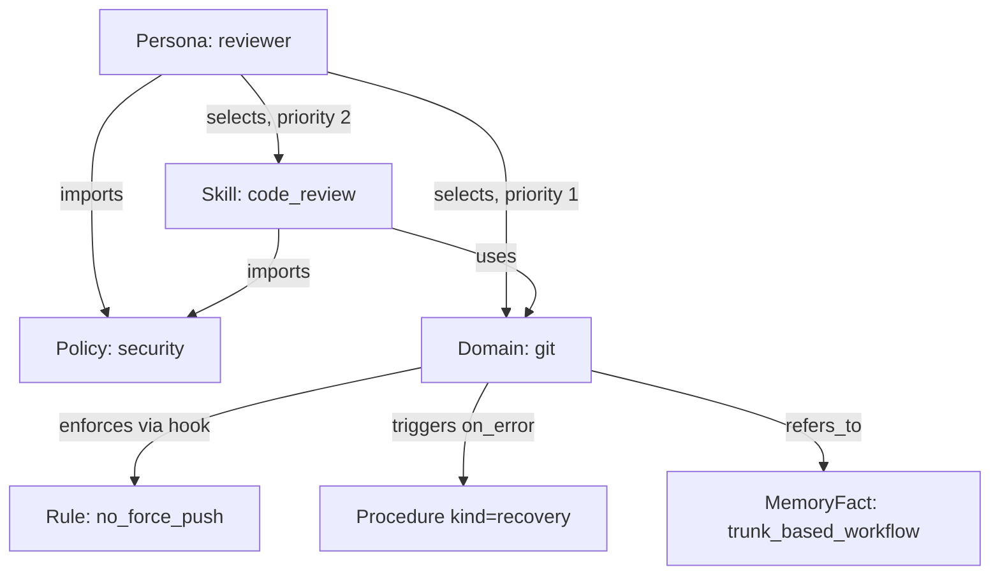

# DomainSpec v2.0 — A Consolidated Specification for Agent Knowledge Architecture

*A revision of the DomainSpec proposal originally sketched by Santiago Javier Espino Heredero (@anarcoiris). v1 correctly diagnosed the problem — knowledge, behavior, and capability shouldn't live in one flat file — but left its own taxonomy inconsistent and its two most interesting ideas (hooks-as-middleware, Progressive Skill Graphs / "OpenClaw") undefined. This document keeps the diagnosis and fixes the design.*

---

## 0. What v1 got right

- Splitting a domain into typed sections instead of one prose file is the correct direction.
- Treating hooks as pluggable, prioritized middleware rather than embedded prose instructions is the most valuable idea in the document.
- Wanting the format to be both human-readable *and* machine-parsable, with on-demand/progressive loading, is the right target to aim at.

v2 keeps all three. Everything below exists to make them actually work.

---

## 1. Where v1 is inconsistent

| # | Problem in v1 | Why it breaks in practice |
|---|---|---|
| 1 | `Tools` and `Tool Preferences` are two sections for one concept | Preference is a *property* of a tool, not a separate category — a parser has to reconcile two lists that describe the same objects |
| 2 | `Rules` and `Anti-patterns` overlap | "Never force push" appears in both, with no indication of whether they're the same constraint expressed twice or two different ones |
| 3 | `Procedures`, `Playbooks`, and `Decision Trees` are three formats for one primitive (a sequence or graph of steps) | `investigate_merge_conflict` and the reflog decision tree are structurally identical — one is prose, one is ASCII art. A parser needs three separate readers for one thing |
| 4 | Hooks are defined twice, with incompatible schemas | The domain example writes `### before_commit` as prose; a later section shows a YAML schema with `when`, `priority`, `apply`. Nothing says which is canonical or how one maps to the other |
| 5 | `Memory` exists both inside every domain file *and* as a top-level `memory/facts.md` | Two sources of truth for the same kind of information, no sync rule |
| 6 | `Skills`, `Domains`, and `Playbooks` aren't distinguished by any rule — only by which folder they sit in | Nothing in the spec tells you where new content should go |
| 7 | The hook `when.stage` field is never enumerated | Only two ad hoc stages ever appear — not a real lifecycle an engine could dispatch on |
| 8 | "Machine-parsable" is asserted, not designed | No schema, no required/optional fields, no types — nothing to validate a `.domain.md` file against |
| 9 | Progressive Skill Graphs and OpenClaw are referenced as if already specified | The "How It Works" section is three bullets with no data structures, no budget/eviction policy, no trigger taxonomy |
| 10 | No versioning field, despite "support versioning and diffs" being a stated next step | There's nothing for a version or diff tool to key off of |

Every fix below traces back to one of these ten rows.

---

## 2. Taxonomy: four node kinds, cleanly separated

v1's `domains/`, `skills/`, `personas/`, `policies/` folders existed but were never given rules for what belongs where (row 6). v2 defines each by what question it answers:

| Kind | Answers | Example |
|---|---|---|
| **Domain** | *What exists* — subject-matter knowledge, concepts, and native capabilities of one technical area | `git`, `python`, `docker` |
| **Skill** | *What I can do* — a composed, cross-domain capability the agent invokes as a unit | `code_review` (spans `git` + `python` + `policies/security`) |
| **Persona** | *How I'm configured* — a named selection and priority ordering of domains/skills/policies, plus a communication style. Adds no new knowledge; it only filters and orders existing knowledge | `reviewer`, `ops_engineer` |
| **Policy** | *What always applies* — a domain-independent rule/heuristic set, importable by any domain or skill | `security`, `privacy`, `universal_heuristics` |

A Policy is, structurally, a Domain with no `tools` and no native `concepts` — it's the same schema (§3) with a narrower purpose. This is why v1's `heuristics/universal.md` folder disappears in v2: a cross-cutting heuristic set *is* a policy, not a fifth category.

---

## 3. File format: YAML front matter + Markdown body

v1's format couldn't be machine-parsed because Markdown headers aren't a stable parse target — renaming `## Rules` to `## Constraints` silently breaks every consumer. v2 borrows the pattern used by static site generators: a fenced YAML block holds the structured graph; the Markdown body below it is documentation for humans, generated from or checked against the front matter rather than being the sole source of truth.

```markdown
---
id: git
type: domain
version: 1.0.0
purpose: Version control for tracking code changes over time.
extends: []
concepts: [...]
tools: [...]
rules: [...]
heuristics: [...]
hooks: [...]
procedures: [...]
memory_refs: [...]
policies_imported: [...]
---

# Git

(human-readable prose, examples, rationale — mirrors the front matter,
doesn't replace it)
```

`domainspec.schema.json` (companion file) validates the front-matter block. That's what makes "machine-parsable" true instead of asserted.

---

## 4. Rules and Heuristics: one severity axis, not two sections

v1's `Rules` and `Anti-patterns` are merged. A rule now carries a `severity`:

- **`hard`** — a MUST/MUST NOT constraint. Violating it blocks the action. (This absorbs everything v1 called an anti-pattern.)
- **`soft`** — a SHOULD NOT. Discouraged, but not blocking; surfaces as a warning.

```yaml
rules:
  - id: no_force_push
    statement: Never force-push to a shared branch without explicit confirmation.
    severity: hard
  - id: prefer_atomic_commits
    statement: Prefer small, atomic commits over large batched ones.
    severity: soft
```

**Heuristics** stay a distinct concept from rules — they're not constraints at all, they're tie-breakers used when multiple valid options exist (e.g., which of two equally-valid tools to call first). Each carries a `weight` used for ranking, not gating.

---

## 5. Tools: preference is a field, not a section

```yaml
tools:
  - id: git_status
    preference_rank: 1
  - id: bash
    preference_rank: 3
    precondition: No dedicated git tool covers this action
```

Lower `preference_rank` wins when more than one tool could satisfy the same step. `precondition` replaces v1's prose rule ("prefer dedicated tools over shell") by attaching the condition directly to the fallback option, so the constraint travels with the tool it constrains instead of living in a separate `Tool Preferences` list.

---

## 6. Procedures: one node-graph model absorbs Procedures, Playbooks, and Decision Trees

This is the biggest structural fix. v1's `create_branch` (linear procedure), `investigate_merge_conflict` (playbook), and the reflog decision tree (branching tree) are the same underlying object — a graph of steps — rendered three different ways. v2 gives them one schema, distinguished only by a `kind` field:

| `kind` | Replaces (v1) | Shape |
|---|---|---|
| `linear` | Procedures | A simple ordered chain |
| `conditional` | Decision Trees | A branching graph, each step optionally forking on a condition |
| `recovery` | Failure Recovery | A procedure with a `trigger` condition, invoked by an `on_error` hook rather than called directly |
| `entrypoint` | Playbooks | A top-level, agent- or user-invocable procedure — usually `conditional`, but exposed as a named workflow rather than an internal step |

**Shorthand for the common case** — a purely linear procedure can just be an ordered list of strings:

```yaml
procedures:
  - id: create_branch
    kind: linear
    title: Create a new branch
    steps:
      - Check out the target branch
      - Verify current state is clean
      - Create the new branch with a descriptive name
```

**Full node-graph form** for anything that branches (this replaces v1's ASCII decision tree):

```yaml
  - id: recover_lost_commit
    kind: conditional
    title: Recover a commit that seems to be gone
    entry: q_was_committed
    steps:
      - id: q_was_committed
        action: Was the change ever committed?
        branches:
          "yes": step_checkout
          "no": step_reflog
      - id: step_checkout
        action: git checkout <previous-commit>
      - id: step_reflog
        action: Use `git reflog` to locate and recover the dangling commit
```

`investigate_merge_conflict` from v1 becomes a `kind: entrypoint` procedure built from the same node shape — it's not a different primitive, just a procedure with a name the agent can call directly, typically composed by referencing other procedures' `id`s as steps.

---

## 7. Hooks: one canonical schema, a real lifecycle

Row 4's inconsistency is resolved by declaring the YAML form canonical. The Markdown `### before_commit` style becomes a *rendering* of the YAML, never authored separately.

```yaml
hooks:
  - id: pre_commit_check
    when:
      stage: pre_action
      event: git_commit
    priority: 10
    scope: git
    apply:
      rule_refs: [no_force_push]
      checklist:
        - Tests pass
        - Working tree is clean
        - Commit message exists
```

`apply` may reference `rule_refs`, `heuristic_refs`, a `checklist`, and/or a `procedure_ref` — at least one is required. Referencing existing rule/heuristic/procedure IDs instead of re-embedding prose is what keeps a hook from silently drifting out of sync with the rule it's supposed to enforce.

`when.stage` is now a closed, dispatchable lifecycle instead of two ad hoc examples:

| Stage | Fires |
|---|---|
| `session_start` | Once, when this node is first loaded into context |
| `pre_plan` | Before the agent forms a plan, while relevant domains are still being selected |
| `tool_selection` | When the agent is choosing which tool to call next |
| `pre_action` | Immediately before a tool call executes |
| `post_action` | Immediately after a tool call returns |
| `on_error` | When a tool call or procedure fails — typically triggers a `recovery` procedure |
| `on_conflict` | When two loaded nodes disagree (§9) |
| `session_end` | Once, when the node is unloaded |

Lower `priority` number = runs first, matching common middleware convention.

---

## 8. Memory: one store, referenced not duplicated

Row 5's two sources of truth collapse into one. `memory/` is the only place facts live; domain files hold pointers.

```yaml
# inside git.domain.md
memory_refs: [git.repo.trunk_based_workflow, git.repo.semver_commits]
```

```yaml
# memory/git.repo.trunk_based_workflow.md
---
id: git.repo.trunk_based_workflow
subject: this repository
fact: Uses a trunk-based workflow.
confidence: high
source: observed
last_updated: 2026-06-01
---
```

Facts are timestamped and sourced so staleness is detectable — v1's inline `Memory` section had no way to tell a fact from 2019 apart from one from this morning.

---

## 9. The graph model, formally

### Node types

| Node | Lives in |
|---|---|
| Domain, Skill, Persona, Policy | their own top-level folders |
| Concept, Tool, Rule, Heuristic, Hook, Procedure | inline, inside the owning Domain/Skill file |
| MemoryFact | `memory/`, referenced via `memory_refs` |

### Edge types

| Edge | Meaning |
|---|---|
| `extends` | A domain/skill inherits from another |
| `uses` | A procedure or hook references a tool |
| `enforces` | A hook enforces a rule |
| `guides` | A hook applies a heuristic |
| `triggers` | A hook invokes a procedure |
| `overrides` | A persona changes a rule/heuristic's effective priority, or disables it |
| `imports` | A domain/skill pulls in a policy |
| `refers_to` | A domain references a MemoryFact |



---

## 10. Progressive loading — what "Progressive Skill Graph" and "OpenClaw" actually are

Row 9's gap: v1 named two systems and specified neither. In v2 they're the two halves of one mechanism, not two systems:

- **Progressive Skill Graph** = the data structure — the graph described in §9.
- **OpenClaw** = the runtime component that walks it — the loader below.

```text
state:
  active = {}          # node_id -> {node, priority, last_used, tokens, pinned}
  budget_used = 0
  budget = MAX_CONTEXT_TOKENS

on session_start(persona):
  for node_id in persona.domains + persona.skills (priority order):
      load_stub(node_id)     # id, type, purpose, concepts only —
                              # tools/procedures/hooks NOT pulled in yet
  for policy_id in persona.policies_imported:
      expand(policy_id); pin(policy_id)   # policies are never evicted

on stage_transition(stage, context):
  for node in active.values():
      for hook in node.hooks:
          if hook.when.stage == stage and matches(hook, context):
              run(hook)             # may itself call expand()

def expand(node_id):
  if node_id in active: touch(node_id); return
  node = load_full(node_id)         # now pull tools/procedures/rules/heuristics
  cost = estimate_tokens(node)
  while budget_used + cost > budget:
      evict_least_priority_least_recent()
  active[node_id] = node
  budget_used += cost

def evict_least_priority_least_recent():
  candidates = [n for n in active.values() if not n.pinned]
  victim = min(candidates, key=lambda n: (n.priority, n.last_used))
  unload(victim)
```

**What triggers expansion** (the "on-demand" part v1 gestured at without defining):
- a hook's `apply.procedure_ref` resolving to a node outside the current domain
- an `entrypoint` procedure being invoked by name
- a `conditional` procedure's branch pointing at another domain
- an `on_error` hook firing a `recovery` procedure that lives elsewhere

**Pinning** is the piece v1 never addressed at all: policies like `security` are marked `pinned: true` by the persona, so they survive eviction regardless of context pressure. Without this, a budget-constrained agent could silently drop its safety rules first, since they're used less often than the domain it's actively working in.

---

## 11. Conflict resolution across composed domains

Loading more than one domain/skill/policy at once means their rules or same-stage hooks can disagree. v1 had no answer. v2's precedence order, checked in this sequence until one resolves the tie:

1. **Explicit persona override** — a persona's `overrides` list wins outright.
2. **Specificity** — Policy < Domain < Skill (a skill's rule about *this specific composed task* outranks a general domain rule, which outranks a general policy, mirroring CSS specificity).
3. **Severity** — `hard` beats `soft`.
4. **Priority number** — lower wins.
5. **Unresolved tie** — fire `on_conflict`, log it, and escalate to the human rather than guessing.

---

## 12. Versioning

```yaml
version: 1.2.0
deprecated_since: null
superseded_by: null
```

- **MAJOR** — a rule's meaning changes, or a node is removed
- **MINOR** — additive: new tool, procedure, or hook
- **PATCH** — prose/heuristic wording only, no behavioral change

Diffs are computed on the parsed YAML graph, not as a text diff — a text diff on Markdown headers can't distinguish "reworded a rule" from "changed what the rule means," which is exactly the distinction versioning needs.

---

## 13. Directory structure v2

```text
knowledge/
├── domains/            # type: domain  — subject-matter nouns
│   ├── git.domain.md
│   ├── python.domain.md
│   └── docker.domain.md
├── skills/              # type: skill   — composed, cross-domain verbs
│   └── code_review.skill.md
├── personas/            # type: persona — selection + priority + style
│   └── reviewer.md
├── policies/            # type: policy  — importable, domain-independent
│   ├── security.md
│   └── universal_heuristics.md
├── memory/               # single source of truth, referenced not duplicated
│   └── git.repo.trunk_based_workflow.md
└── _schema/
    └── domainspec.schema.json
```

`templates/`, `heuristics/`, `hooks/`, `playbooks/`, and `decision_trees/` from v1 are gone as top-level folders — each now lives *inside* the domain/skill file that owns it (a hook or procedure divorced from its domain wasn't meaningful anyway). The one genuinely cross-cutting v1 folder, `heuristics/universal.md`, becomes `policies/universal_heuristics.md` — it was already a policy, just not named as one.

---

## 14. v1 → v2 migration map

| v1 concept | v2 resolution |
|---|---|
| `Tools` + `Tool Preferences` | merged: `tools[]` with `preference_rank` |
| `Rules` + `Anti-patterns` | merged: `rules[]` with `severity: hard\|soft` |
| `Procedures` + `Playbooks` + `Decision Trees` | unified: `procedures[]` with `kind: linear\|conditional\|recovery\|entrypoint` |
| Two incompatible hook schemas | one canonical YAML schema (§7); Markdown headers are a generated view |
| Domain-embedded `Memory` + `memory/facts.md` | one `memory/` store; domains hold `memory_refs[]` only |
| `Skills` / `Domains` / `Playbooks` (undistinguished) | Domain = noun, Skill = composed verb, Persona = selection+style, Policy = importable rules (§2) |
| `templates/`, `heuristics/`, `hooks/`, `playbooks/`, `decision_trees/` folders | folded into owning files; cross-cutting heuristics become a Policy |
| "machine-parsable" (asserted) | `domainspec.schema.json` validates every front-matter block |
| Progressive Skill Graph + OpenClaw (undefined) | §9 graph + §10 loader — one mechanism, two names for its data and its runtime |
| No versioning | `version` field + compatibility rules (§12) |

---

## 15. Open questions (honestly, not resolved here)

- **Hook execution sandboxing** — a hook can trigger tool calls; nothing here defines what permissions a hook inherits versus the agent that loaded it.
- **Multi-agent memory sync** — `memory/` assumes one writer. Concurrent agents updating the same `MemoryFact` needs a merge policy this spec doesn't attempt.
- **Simultaneous personas** — §11 resolves conflicts *within* one persona's active graph; two personas active at once (e.g., a supervisor and a sub-agent) isn't addressed.
- **When to split a domain** — no size/complexity heuristic is given for "this domain file is too big, split it." Left to judgment for now.
- **Eval/CI for domain specs** — nothing here defines how you'd regression-test a change to a rule or hook before merging it, the equivalent of a test suite for knowledge.

Companion files: `domainspec.schema.json` (validator) and `git.domain.md` (v1's example, fully rewritten to this spec).
