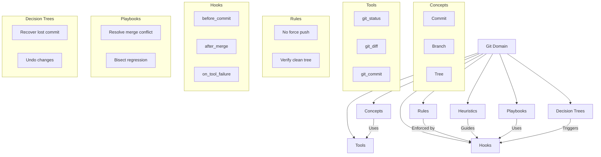

Santiago Javier Espino Heredero 
@anarcoiris

---

# 🚀 Domain Specification (DomainSpec): A New Paradigm for Agent Knowledge

> **The mistake most frameworks make is mixing knowledge, behavior, and capabilities in one document.**  
>  
> A `git_knowledge.md` file often contains:  
> - What Git *is* (knowledge)  
> - How to commit (procedure)  
> - Heuristics like "check status first"  
> - Rules like "never force push"  
> - Tool mappings like "use `git` tool"  
>  
> These are fundamentally different types of information.  
>  
> This document proposes a new abstraction: **Domain Specification (DomainSpec)** — a structured, modular, and composable way to define what an agent needs to know and do within a domain.

---

## 📚 Why DomainSpec?

Instead of:

```markdown
git_knowledge.md
```

We introduce:

```markdown
git_domain_spec.md
```

Or more generally:

> **Domain Specification (DomainSpec)**  
> A self-contained, structured document that specifies *everything an agent needs to operate within a domain* — not just knowledge, but behavior, tools, rules, heuristics, and recovery paths.

---

## 🏗️ Hierarchy: The Domain Specification Tree

```bash
knowledge/
│
├── domains/
│   ├── git.domain.md
│   ├── python.domain.md
│   ├── docker.domain.md
│   ├── linux.domain.md
│   └── web.domain.md
│
├── skills/
│   ├── code_review.skill.md
│   ├── debugging.skill.md
│   └── deployment.skill.md
│
├── personas/
│   ├── architect.md
│   ├── reviewer.md
│   └── ops_engineer.md
│
├── policies/
│   ├── security.md
│   ├── privacy.md
│   └── compliance.md
│
├── templates/
│   ├── issue.md
│   ├── pr.md
│   └── config.md
│
├── heuristics/
│   ├── universal.md
│   ├── coding.md
│   └── shell.md
│
├── hooks/
│   ├── before_tool.md
│   └── after_tool.md
│
├── playbooks/
│   ├── investigate_bug.md
│   └── release.md
│
├── decision_trees/
│   └── debugging.tree.md
│
└── memory/
    └── facts.md
```

> Each file is **self-contained**, reusable, and composable.  
> The structure enables modular reasoning: agents can load only what they need.

---

## 🧩 Structure of a Domain Specification

Each domain specification follows a consistent schema with clearly defined sections.

```markdown
# Domain

Git

---

## Purpose

Version control for tracking code changes over time.

---

## Concepts

- Repository  
- Commit  
- Tree  
- Blob  
- Branch  

> These are the foundational building blocks of the domain.

---

## Capabilities

- Inspect repository state  
- Modify history  
- Stage files  
- Resolve conflicts  

> What actions can the agent perform?

---

## Tools

- `git_status`  
- `git_commit`  
- `bash`  
- `grep_search`  

> The specific tools available in this domain.

---

## Tool Preferences

- Prefer dedicated Git tools over shell commands.  
- Prefer `status` before `diff`.  
- Prefer `diff` before `commit`.  

> How to prioritize tool selection for optimal outcomes.

---

## Rules

- Never force push unless explicitly requested.  
- Never rewrite public history.  
- Never delete branches without confirmation.  

> Hard constraints that must be enforced.

---

## Heuristics

- Search commit history before blaming a file.  
- Small, atomic commits are preferred.  
- Always check for a clean working tree before merging.  

> Guiding principles that improve decision quality.

---

## Hooks

### before_commit

Ensure:

- Tests pass  
- Working tree is clean  
- Commit message exists  

> A pre-action check triggered before committing.

### after_merge

Run tests and verify integration.

> A post-action step to validate outcomes.

### tool_failed

Attempt recovery: retry, fallback, or escalate.

> A failure-handling mechanism.

---

## Procedures

### create_branch

1. Check out the target branch  
2. Verify current state  
3. Create new branch with descriptive name  

> Step-by-step instructions for a common action.

### squash_commits

1. Identify commits to squash  
2. Generate a meaningful commit message  
3. Apply changes and push  

> A procedure for cleaning up history.

---

## Playbooks

### investigate_merge_conflict

1. Check conflict files  
2. Review commit history  
3. Use `git merge --abort` if needed  
4. Propose resolution strategy  

> A reusable workflow for a common problem.

---

## Decision Trees

```text
Need previous version?

↓
Committed?

↓
YES → checkout previous commit  
↓
NO → use reflog to recover
```

> A structured way to make decisions based on state.

---

## Anti-patterns

- Force pushing  
- Detached HEADs  
- Committing secrets  

> Actions that should be avoided at all costs.

---

## Failure Recovery

### Merge conflict

→ Abort operation  
→ Retry with updated context  
→ Escalate to human review  

> How to recover from common failures.

---

## Memory

Useful facts to remember:

- This repository uses a trunk-based workflow.  
- Commits follow semantic versioning.  

> Persistent knowledge that improves long-term reasoning.

---

## Examples

### Good

```bash
git status
git add .
git commit -m "Fix login issue"
```

### Bad

```bash
git push -f origin main
# (force pushes to public branch without review)
```

> Clear examples of correct vs. incorrect behavior.

---

## 🚀 Key Insight: Hooks as First-Class Citizens

Rather than embedding hooks in procedural sections, **hooks should be composable, dynamic, and middleware-like**.

### ✅ Hook Definition (YAML)

```yaml
hooks:

- id: before_tool_selection
  when:
    stage: tool_selection
  priority: 10
  apply:
    heuristic:
      Prefer dedicated tools.
    rule:
      Avoid shell if equivalent Git tool exists.

- id: before_file_write
  when:
    action: write_file
  apply:
    checklist:
      - Does the file exist?
      - Create a backup?
      - Apply formatting (e.g., Prettier)?
```

> Hooks are **pluggable, prioritized, and context-aware**.  
> They can be activated dynamically based on agent state or environment.

---

## 🌲 The DomainSpec as a Graph

> **A domain is not a linear document — it's a network of typed nodes and edges.**

This is where the real power lies.

### 📈 DomainSpec as a Knowledge Graph



> Each section is a **typed node** in the graph.  
> Cross-references (e.g., "this playbook uses these hooks and tools") become **explicit edges**.

---

## 🔍 Progressive Skill Graphs & DomainSpec Integration

This structure aligns perfectly with your work on:

- **Progressive Skill Graphs**  
- **OpenClaw** (dynamic, context-aware skill composition)

### How It Works

1. **Initial Load**: Agent loads only the root domain (`Git Domain`) and core concepts.
2. **State-Based Traversal**: As the agent progresses:
   - Enters `heuristics` when making decisions
   - Traverses to `tools` when executing actions
   - Activates `hooks` at key stages
   - Expands into `playbooks` or `decision trees` when facing complex problems
3. **On-Demand Expansion**: The agent dynamically loads only what’s needed — no full domain ingestion upfront.

> This enables **efficient, scalable, and context-aware reasoning**.

---

## ✅ Summary: Why This Matters

| Benefit | Explanation |
|-------|-------------|
| **Modularity** | Each component is reusable and composable. |
| **Clarity** | Every section answers one clear question. |
| **Composability** | Hooks and graphs enable dynamic, flexible behavior. |
| **Progressive Reasoning** | Agents grow their knowledge incrementally. |
| **Human-Readable** | The Markdown format remains accessible to humans. |
| **Machine-Parsable** | Can be parsed into structured graphs for agents. |

---

## 🚀 Next Steps

1. **Implement DomainSpec as a standard** in agent frameworks.
2. **Build a parser** that converts `.domain.md` files into knowledge graphs (e.g., using YAML or Mermaid).
3. **Integrate with OpenClaw / Progressive Skill Graphs** to enable dynamic traversal.
4. **Create templates** for common domains (Git, Python, Docker, etc.).
5. **Support versioning and diffs** for domain evolution.

---

> 📌 Final Thought:  
> **DomainSpec is not just a document — it's a living, evolving architecture for intelligent agents.**  
> It separates *what* an agent knows from *how* it behaves, enabling richer, more robust, and scalable AI systems.

---

✨ *DomainSpec: Where knowledge meets behavior, structure meets intelligence.*

---

Let me know if you'd like:
- A Mermaid.js version of the graph for embedding
- A template generator (e.g., `git_domain_spec.md`)
- A parser specification (e.g., in YAML or JSON Schema)
- A GitHub-ready directory structure

Happy to help expand this further! 🚀

--- 

✅ *Formatted, structured, and ready for documentation, presentation, or implementation.*