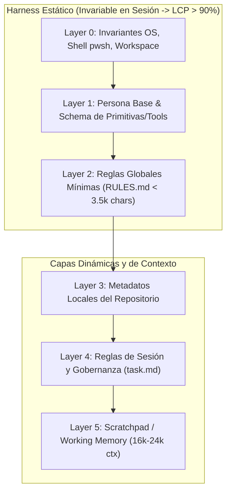
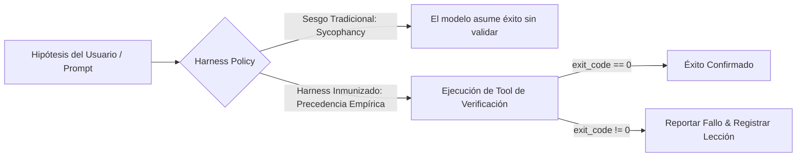
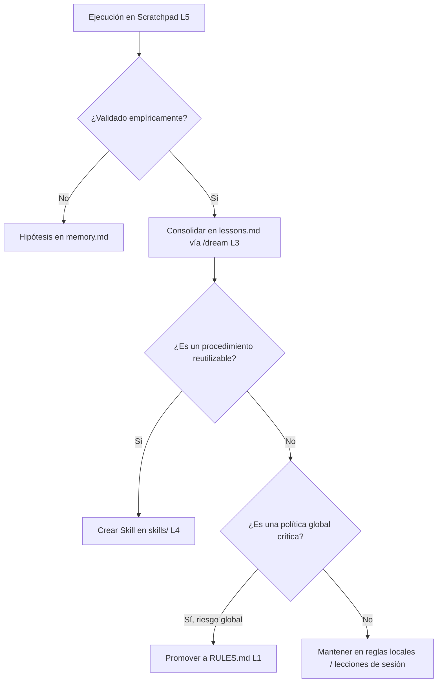

# 🏛️ Documento Maestro Integral: Revisión Razonada y Plan de Acción/Investigación Arquitectónica
## Harness de Bootstrapping, Taxonomía de Reglas (Global/Local/Sesión), Subagentes Atómicos, Topología Multi-GPU y Memoria Estratificada

- **Documento:** `docs/rules_harness_and_memory_architecture_plan.md` (y `plans/rules_harness_and_memory_architecture_plan.md`)
- **Versión:** 2.0.0 (Unificada e Integral)
- **Fecha:** 2026-09-01
- **Autor:** Antigravity Pairing System (Wingman Agent & Tiny-Steward Core)
- **Ámbito:** Kernel de Ejecución Tiny Steward, Sistema de Sesiones, Backend Gate y Harness Global de Antigravity

---

## 📑 Tabla de Contenidos
1. [Resumen Ejecutivo y Marco Teórico](#1-resumen-ejecutivo-y-marco-teórico)
2. [Eje 1: Harness de Bootstrapping, Estabilidad KV-Cache (LCP) y Taxonomía de Reglas](#2-eje-1-harness-de-bootstrapping-estabilidad-kv-cache-lcp-y-taxonomía-de-reglas)
3. [Eje 2: Mitigación de Sugestión, Complacencia (Sycophancy) y Sesgos de Anclaje](#3-eje-2-mitigación-de-sugestión-complacencia-sycophancy-y-sesgos-de-anclaje)
4. [Eje 3: Subagentes Atómicos ('Execution Workers' Sin Cuestionar) y Aislamiento de Contexto](#4-eje-3-subagentes-atómicos-execution-workers-sin-cuestionar-y-aislamiento-de-contexto)
5. [Eje 4: Topología Multi-GPU (GTX 1080 / 1070), Docker Display-Safe y Backend Gate](#5-eje-4-topología-multi-gpu-gtx-1080--1070-docker-display-safe-y-backend-gate)
6. [Eje 5: Jerarquía de Memoria, Soberanía de `task.md` y Protocolo de Promoción de Reglas](#6-eje-5-jerarquía-de-memoria-soberanía-de-taskmd-y-protocolo-de-promoción-de-reglas)
7. [Eje 6: Refactorización de Plantillas de Revisión y Ciclo de Feedback](#7-eje-6-refactorización-de-plantillas-de-revisión-y-ciclo-de-feedback)
8. [Matriz Integral de Implementación, Hitos (P0/P1/P2) y Métricas de Éxito](#8-matriz-integral-de-implementación-hitos-p0p1p2-y-métricas-de-éxito)

---

## 1. Resumen Ejecutivo y Marco Teórico

El harness de un agente autónomo no es un mero contenedor de texto ni un simple formateador de mensajes: es el **sistema operativo cognitivo** que gobierna los permisos de ejecución, las primitivas de cómputo, el presupuesto de atención contextual y la integridad de la memoria a corto y largo plazo.

En arquitecturas con inferencia local (ej. `llama.cpp` distribuido en multi-GPU con `--parallel` y slots fijos) o modelos en la nube, el diseño del prompt inicial y su persistencia en el **KV-Cache (Longest Common Prefix o LCP)** determina la latencia por token, el consumo de VRAM y la agilidad de la sesión.

Este documento unifica **todos los diagnósticos, planes de investigación experimental y planes de acción concretos** desarrollados en la sesión, articulando:
1. **La estabilidad del KV-Cache (LCP)** frente a la inmutabilidad de capas de prompt.
2. **La taxonomía tripartita de reglas:** Globales mínimas, Locales de repositorio y de Sesión en `task.md`.
3. **La erradicación de sesgos de sugestión, complacencia (*sycophancy*) e ilusión de progreso**.
4. **El subagente atómico como ejecutor quirúrgico 'sin cuestionar'** con presupuesto limpio de 16k–24k tokens.
5. **La distribución multi-GPU:** GPU0 (GTX 1080, display/GUI seguro + Docker 32k) y GPU1/GPU2 (2x GTX 1070, cómputo paralelo) gobernadas por `backends.gate`.
6. **La estratificación ontológica de memoria:** Scratchpad (L5) < RAG (L4) < `lessons.md` (L3) < `task.md` (L2) < `RULES.md` (L1) y su protocolo anti-inflación de reglas (*Rule Creep*).

---

## 2. Eje 1: Harness de Bootstrapping, Estabilidad KV-Cache (LCP) y Taxonomía de Reglas

### 2.1. Diagnóstico y Problemática Actual
- **Estructura de Capas en `core/system_prompt.py`:**
  El runtime construye el system prompt concatenando 4 bloques secuenciales:
  * **Layer 0:** Invariantes de OS, Shell (`pwsh`), Path Style y Workspace Directory.
  * **Layer 1:** Persona Base y Schema de Primitivas/Tools.
  * **Layer 2:** Reglas Globales (`RULES.md`).
  * **Layer 3:** Plan de Tarea Activo (`task.md`).
- **Problema de Invalidación de Prefijo (LCP Drop):**
  Si `RULES.md` o las invariantes se modifican en caliente, o si contienen variables dinámicas (fechas, horas, variables de sesión), el **LCP cae al 0%**. Esto destruye el caché KV de `llama.cpp`, forzando al hardware a reprocesar miles de tokens en cada turno interactivo.
- **Sobrecarga y Ambigüedad de Reglas:**
  Ciertas reglas en lenguaje natural apelan a "buenas intenciones" sin un soporte determinista en código (ej. advertencias textuales de no usar `bash` en Windows). Si el harness solo ruega en lugar de interceptar, el agente falla ante la ambigüedad.



### 2.2. Taxonomía Tripartita de Reglas
Para reconciliar la inmutabilidad del prefijo con la flexibilidad operativa, se formaliza la siguiente estructura:

```
┌─────────────────────────────────────────────────────────────────────────────┐
│ 1. REGLAS GLOBALES (Mínimas y Generalistas)                                │
│    - Ubicación: Layer 0/1 Prompt Base + RULES.md raíz                       │
│    - Contenido: Invariantes OS (Windows, pwsh, cwd), directivas de seguridad│
│      fundamentales y principios MEMENTO.                                    │
│    - Propósito: 100% Estáticas para preservar LCP en KV-Cache.              │
├─────────────────────────────────────────────────────────────────────────────┤
│ 2. REGLAS LOCALES (Proyecto / Repositorio)                                  │
│    - Ubicación: workspace_rules / repo RULES.md / metadatos de control      │
│    - Contenido: Dominios de skills disponibles, datos de control de tareas, │
│      estados del proyecto, dependencias y convenciones del repositorio.     │
│    - Propósito: Proveer contexto de ingeniería sin saturar el prompt base.  │
├─────────────────────────────────────────────────────────────────────────────┤
│ 3. REGLAS DE SESIÓN (Directorio de Trabajo / Tarea Activa)                 │
│    - Ubicación: task.md / session_rules en sessions/<name>/                 │
│    - Contenido: Instrucciones operativas ultra-precisas, rutas relativas    │
│      del sprint, objetivos específicos y checklist de entrega.              │
│    - Propósito: Gobernanza de la misión actual sin afectar a otras sesiones.│
└─────────────────────────────────────────────────────────────────────────────┘
```

### 2.3. Plan de Investigación (🔬 Research Plan)
1. **R1.1 — Benchmark de Estabilidad LCP:**
   - Medir el impacto de variaciones en L0, L1 y L2 sobre la tasa de reuso de KV-Cache en `llama.cpp` (`--parallel 1` y `--parallel N`).
   - Identificar si las inyecciones de `task.md` dentro del system prompt rompen el prefijo compartido entre sesiones secundarias y evaluar su reubicación como mensaje inicial de usuario estructurado o inyección controlada.
2. **R1.2 — Auditoría de Límites de Tamaño y Densidad Semántica:**
   - Analizar el umbral óptimo de caracteres para `RULES.md` (establecer un techo duro de 3.500–4.000 caracteres) y verificar el ratio de cumplimiento de directivas en función de la longitud del prompt.

### 2.4. Plan de Acción / Implementación (🛠️ Action Plan)
1. **A1.1 — Inmutabilidad Estricta de Capas 0 y 1:**
   - Congelar de forma determinista el texto de L0 (Invariantes OS) y L1 (Persona / Tools) en `core/system_prompt.py`. Prohibir inyecciones de timestamps o rutas volátiles dentro del prefijo base.
2. **A1.2 — Refactorización Estructurada de `RULES.md`:**
   - Adoptar formato estándar con metadatos YAML frontmatter y cuerpo declarativo conciso:
     * **Hard Rules:** Directivas operativas críticas (CWD en workspace, no pegar transcripciones crudas, uso de `replace` sobre `write`).
     * **Soft Rules:** Pautas de interacción y persona (tutela de Tiny-Steward, tono directo).
3. **A1.3 — Sustitución de Ruegos por Guardrails Deterministas en el Runtime:**
   - Interceptar en `core/prompt_hygiene.py` y `core/runtime_execution.py` comandos no autorizados (ej. bloquear `bash`/`cat`/`grep` Unix en Windows a nivel de dispatch y sugerir automáticamente `pwsh`).

---

## 3. Eje 2: Mitigación de Sugestión, Complacencia (Sycophancy) y Sesgos de Anclaje

### 3.1. Diagnóstico y Problemática Actual
- **Sycophancy (Falsa Confirmación):** Cuando el usuario o un prompt previo sugiere una hipótesis no verificada (ej. *"creo que el fallo es de permisos en Windows"*), el LLM tiende a sesgar su razonamiento para validar dicha hipótesis, obviando pruebas empíricas.
- **Few-Shot Anchoring:** Ejemplos fijos en el system prompt (como `wireshark` o `help("tshark...")`) atraen al modelo hacia patrones miméticos irrelevantes ante problemas ambiguos.
- **Ilusión de Progreso:** El modelo emite respuestas asumiendo que un cambio solucionó un problema sin haber ejecutado un test de validación o verificado el `exit_code == 0`.



### 3.2. Plan de Investigación (🔬 Research Plan)
1. **R2.1 — Evaluación de Complacencia con Test Suites Adversarias:**
   - Diseñar casos de prueba donde el prompt del usuario incluya asunciones deliberadamente falsas para evaluar si el agente las contradice basándose en herramientas o si claudica acríticamente.
2. **R2.2 — Medición del Efecto de Anclaje de Stubs:**
   - Cuantificar la frecuencia con la que el modelo invoca herramientas o formatos mostrados en los ejemplos del prompt base frente a definiciones abstractas.

### 3.3. Plan de Acción / Implementación (🛠️ Action Plan)
1. **A2.1 — Principio de Precedencia de Evidencia Empírica:**
   - Establecer como invariante en el sistema que ninguna afirmación de corrección o éxito es válida si no va acompañada de un resultado observable de herramienta (`pytest`, `read`, `status`, assertions).
2. **A2.2 — Desanclaje de Ejemplos en `core/system_prompt.py`:**
   - Eliminar stubs específicos de tecnologías puntuales del prompt base y reemplazarlos por esquemas formales sintácticos puros. Los ejemplos de dominio deben residir exclusivamente en `skills/**/SKILL.md`.
3. **A2.3 — Detección y Freno de Bucles de Autocomplacencia:**
   - Enriquecer `RuntimeLoopMixin` para detectar cuando el modelo genera texto de éxito sin haber ejecutado ninguna acción de verificación en los últimos turnos.
4. **A2.4 — Sandboxing Estricto y Confinamiento de Workspace (G1):**
   - Interceptar en `resolve_path` y en las primitivas de mutación (`write`, `replace`, `append`, `mkdir`) cualquier intento de escribir fuera de `workspace_dir` o directorios de sesión autorizados, bloqueando fugas hacia proyectos ajenos.
5. **A2.5 — Bloqueo de Mutación de Skills / Skill Immutability Lock (G2):**
   - Prohibir que el agente modifique archivos fuente en `skills/` durante la ejecución de tareas ordinarias. Si una skill falla, el agente debe registrar el bug en `lessons.md` o probar en un archivo dummy, pero nunca alterar la biblioteca instalada.
6. **A2.6 — Circuit-Breaker Anti-Thrashing en Bucles de Rethink (G3):**
   - Limitar a un máximo de 2 intentos consecutivos de modificación sobre el mismo archivo en caso de fallos repetidos en un turno, abortando bucles de adivinanza errática.
7. **A2.7 — Introspección Determinista de APIs ante TypeError / AttributeError (G4):**
   - Ante errores de firma o atributo en Python, guiar al modelo a inspeccionar el módulo con `python -c "import <mod>; help(<mod>)"` en lugar de adivinar nombres de parámetros.

---

## 4. Eje 3: Subagentes Atómicos ('Execution Workers' Sin Cuestionar) y Aislamiento de Contexto

### 4.1. Diagnóstico y Rol del Subagente Atómico
El subagente no es un orquestador deliberativo ni un planificador redundante; es un **trabajador de ejecución quirúrgica sin cuestionar**.

* **Cometido Operativo:**
  - Actualizar reglas locales y metadatos del repositorio.
  - Modificar y mantener actualizado el `task.md` y `lessons.md`.
  - Crear referencias, inspeccionar archivos y extraer datos específicos.
  - Ejecutar scripts de validación y capturar métricas.
* **Presupuesto Contextual y de Cómputo:**
  - **Ventana de Contexto:** Ultraligera, **16k a 24k tokens** (máximo 32k).
  - **Patrón de Inferencia:** 1 o 2 encodings iniciales + 1 rethink intermedio puntual.
  - **Aislamiento:** No hereda el historial completo de la conversación; recibe un **Task Contract** autocontenido.

```mermaid
graph TD
    subgraph Orquestador (Primary Lane)
        ORCH["Orquestador (Qwythos / Gemini)"]
        TASK_GOV["Gobernanza de task.md"]
    end
    
    subgraph Subagente Atómico (Worker Lane)
        CONTRACT["Task Contract (16k-24k ctx)"]
        EXEC["Ejecución Sin Cuestionar:
        - Actualizar reglas locales
        - Actualizar task.md
        - Modificar ficheros
        - Ejecutar tests"]
        RETHINK["Rethink Breve (1 turno)"]
    end

    ORCH -->|"delegate(agent, contract)"| CONTRACT
    CONTRACT --> EXEC
    EXEC --> RETHINK
    RETHINK -->|"delegate_result (Mailbox)"| ORCH
```

### 4.2. Plan de Investigación (🔬 Research Plan)
1. **R3.1 — Eficiencia de Token Budget en Lane Atómico:**
   - Comparar el rendimiento y ratio de éxito de subagentes con contexto podado (solo contrato de tarea) vs contexto completo heredado.
2. **R3.2 — Análisis de Latencia y Serialización:**
   - Monitorear el comportamiento de colas de subagentes cuando el backend corre con `--parallel 1` vs `--parallel N` mediante el `backends.gate`.

### 4.3. Plan de Acción / Implementación (🛠️ Action Plan)
1. **A3.1 — Especificación del 'Task Contract Spec' para `delegate()`:**
   - Cada delegación contendrá:
     * `problem_statement`: Definición precisa del objetivo.
     * `target_artifacts`: Rutas de archivos a inspeccionar o modificar.
     * `acceptance_criteria`: Comando o condición determinista de éxito (ej. `pytest tests/test_foo.py`).
     * `context_attachments`: Solo los fragmentos estrictamente necesarios vía `@path`.
2. **A3.2 — Control de Presupuesto y Límites de Turnos:**
   - Configurar límites estrictos (`max_delegate_turns: 10`, `max_tokens` contenido) para evitar bucles infinitos de reintento.
3. **A3.3 — Retorno Estructurado Asíncrono (`Mailbox`):**
   - Canalizar la finalización de subagentes exclusivamente a través de mensajes `delegate_result` en el buzón estructurado.

---

## 5. Eje 4: Topología Multi-GPU (GTX 1080 / 1070), Docker Display-Safe y Backend Gate

### 5.1. Distribución de Hardware y Topología Multi-GPU

| Dispositivo | Rol de Hardware | Configuración de Carga y Contexto |
| :--- | :--- | :--- |
| **GPU0 (GTX 1080)** | **Display Principal / GUI** | Uso prioritario para entorno gráfico del usuario. Alojamiento opcional de **Subagentes Atómicos ultraligeros (~32k ctx)** en contenedor Docker dedicado para no degradar la interfaz de usuario. |
| **GPU1 (GTX 1070)** | **Compute Lane 1 (Paralelo)** | Modelo Orchestrator / Subagente 1 en inferencia local `llama.cpp`. |
| **GPU2 (GTX 1070)** | **Compute Lane 2 (Paralelo)** | Modelo Atomic / Subagente 2 en inferencia paralela para ejecución concurrente. |

### 5.2. Arquitectura de Arbitraje del Backend Gate
El componente `core/backend_gate.py` actúa como semáforo y despachador inteligente para que una única terminal interactiva aproveche la inferencia concurrente:

```mermaid
flowchart TD
    REQ[Petición de Inferencia: Orch / Atomic / Dream] --> GATE{BackendGate}
    
    subgraph "Arbitraje de Slots y Prioridades"
        GATE -->|Prioridad 0: Interactive| Q_INT[Cola Interactiva]
        GATE -->|Prioridad 1: Dream| Q_DREAM[Cola Consolidación]
        GATE -->|Prioridad 2: Background| Q_BG[Cola Segundo Plano]
    end
    
    Q_INT --> DISPATCH{¿Lane Disponible?}
    Q_DREAM --> DISPATCH
    Q_BG --> DISPATCH
    
    DISPATCH -->|Slot GPU1/GPU2 Libre| PARALLEL_LANE[Lanes Paralelos (2x GTX 1070)]
    DISPATCH -->|Slot GPU0 Libre (Cap 32k)| ATOMIC_DOCKER[Docker Ligero GPU0 (GTX 1080 Display-Safe)]
    DISPATCH -->|Lanes Ocupados| WAIT[Espera con Timeout y HTTP 503 Retry]
```

### 5.3. Plan de Investigación (🔬 Research Plan)
1. **R4.1 — Medición de VRAM y Frametime en Display con GPU0:**
   - Medir el impacto en el escritorio y aplicaciones GUI al cargar un modelo atómico de 32k ctx en GPU0 frente a dejarla 100% limpia.
2. **R4.2 — Benchmarking de Rendimiento Concurrente en GPU1 + GPU2:**
   - Evaluar el throughput en tokens/segundo de orquestador y subagente corriendo en paralelo en las dos GTX 1070.

### 5.4. Plan de Acción (🛠️ Action Plan)
1. **A4.1 — Configuración Multi-Slot en `config.yaml`:**
   - Habilitar `orch_slots: 1` y `atomic_slots: 2` (mapeando a los backends de las 2x GTX 1070).
2. **A4.2 — Perfil Docker Atómico Display-Safe:**
   - Definir script de arranque para contenedor atomic en GPU0 con límite estricto de contexto (`-c 32768`) y asignación de VRAM controlada para proteger el display.
3. **A4.3 — Coordinación de Sprints Concurrentes:**
   - Permitir que el orquestador lance tareas en segundo plano a los subagentes atómicos mientras la terminal principal atiende al usuario.

---

## 6. Eje 5: Jerarquía de Memoria, Soberanía de `task.md` y Protocolo de Promoción de Reglas

### 6.1. Pirámide Ontológica de Memoria

```
┌─────────────────────────────────────────────────────────────┐
│  L1: REGLAS GLOBALES (RULES.md, Invariantes Inmutables)     │ ◄── Suprema, inmutable por sesión
├─────────────────────────────────────────────────────────────┤
│  L2: GOBERNANZA DE TAREA (task.md, plan.md)                 │ ◄── Soberanía del objetivo activo
├─────────────────────────────────────────────────────────────┤
│  L3: MEMORIA EPISÓDICA (memory.md, lessons.md vía /dream)   │ ◄── Hechos y lecciones validadas
├─────────────────────────────────────────────────────────────┤
│  L4: RAG SEMÁNTICO Y SKILLS (skills/, help())               │ ◄── Conocimiento on-demand
├─────────────────────────────────────────────────────────────┤
│  L5: SCRATCHPAD & WORKING MEMORY (16k-24k ctx, <think>)     │ ◄── Volátil, subordinado
└─────────────────────────────────────────────────────────────┘
```

### 6.2. Relación y Soberanía entre Capas
1. **El Scratchpad (L5) está por debajo de `task.md` (L2):**
   - El scratchpad es transitorio y se descarta durante la compactación de contexto.
   - Si un objetivo solo reside en el chat/scratchpad, se perderá. `task.md` es la única fuente de verdad persistente sobre los hitos completados y pendientes.
2. **El Scratchpad (L5) está por debajo del RAG (L4):**
   - No se deben memorizar manuales enteros en el working context. Se consulta el skill necesario mediante `help()`, se opera y se libera contexto.
3. **Resiliencia de `task.md` en la Compactación:**
   - Durante `_compact_messages`, el contenido de `task.md` y `memory.md` debe reinyectarse automáticamente en el resumen de sistema para evitar la amnesia de objetivos.

### 6.3. Protocolo de Promoción de Reglas (Evitar Rule Creep)



### 6.4. Plan de Acción (🛠️ Action Plan)
1. **A5.1 — Blindaje de Inyección de `task.md`:**
   - Garantizar que `RuntimeCompactionMixin` preserve de forma indestructible el estado de `task.md` tras cualquier evento de compactación.
2. **A5.2 — Pipeline de Consolidación Sanitizado (`core/dreaming.py`):**
   - Mantener el gatekeeper de salud (`assess_session_health`) para aislar trazas corruptas en `quarantine/`.
   - Separar estrictamente `facts` (hechos comprobados) de `hypotheses` (hipótesis) en `memory.md`.
3. **A5.3 — Auditoría Semanal de `RULES.md`:**
   - Establecer revisiones periódicas para podar reglas redundantes o específicas de proyecto que deban residir en `skills/`.

---

## 7. Eje 6: Refactorización de Plantillas de Revisión y Ciclo de Feedback

### 7.1. Plantilla Estandarizada (`docs/planning_template.md`)
La plantilla actualizada incluye:
- **Cabecera Formal:** Sesión ID, timestamp, agente, modelo y estado.
- **Evidencia Empírica:** Comandos, exit codes y ficheros creados.
- **Lecciones y Causa Raíz:** Registro de desviaciones y soluciones permanentes.
- **Checklist Trazable:** Tareas pendientes directamente enlazadas a `task.md`.

---

## 8. Matriz Integral de Implementación, Hitos (P0/P1/P2) y Métricas de Éxito

| Eje | Tarea / Hito | Archivos / Componentes | Prioridad | Métrica de Éxito |
| :--- | :--- | :--- | :--- | :--- |
| **Eje 1** | Inmutabilidad L0/L1 y LCP Caching | `core/system_prompt.py` | **P0** | LCP > 90% en sesiones locales recurrentes |
| **Eje 1** | Taxonomía Tripartita de Reglas | `RULES.md`, `core/system_prompt.py` | **P0** | `RULES.md` global < 3.5k chars; metadatos locales en RAG |
| **Eje 1** | Guardrails de Shell deterministas | `core/prompt_hygiene.py`, `core/runtime_execution.py` | **P1** | 0 comandos incompatibles ejecutados en runtime Windows |
| **Eje 2** | Precedencia de Evidencia Empírica | `core/runtime_loop.py` | **P0** | 100% de tareas cerradas con tool call de validación previa |
| **Eje 2** | Desanclaje de Stubs en System Prompt | `core/system_prompt.py` | **P1** | Cero sesgo por tecnologías de ejemplo en tareas neutras |
| **Eje 3** | Task Contract Specification | `core/runtime_delegate.py` | **P1** | Subagentes ejecutando con < 4k tokens de contexto limpio |
| **Eje 3** | Subagentes Atómicos (16k-24k ctx) | `core/runtime_delegate.py` | **P1** | Subagentes ejecutan en < 2 turns sin alucinaciones |
| **Eje 4** | Backend Gate y Multi-GPU (GTX 1080/1070) | `core/backend_gate.py`, `config.yaml` | **P1** | Concurrencia real sin caída de FPS/interactividad en display |
| **Eje 5** | Blindaje de `task.md` en Compaction | `core/runtime_compaction.py` | **P0** | Cero amnesia de objetivos de sesión tras podas de contexto |
| **Eje 5** | Protocolo de Promoción de Reglas | `RULES.md`, `core/dreaming.py` | **P1** | Tamaño de `RULES.md` contenido; prevención de *Rule Creep* |
| **Eje 6** | Estandarización de `planning_template.md`| `docs/planning_template.md` | **P2** | Revisiones reproducibles y estructuradas en todas las sesiones |
