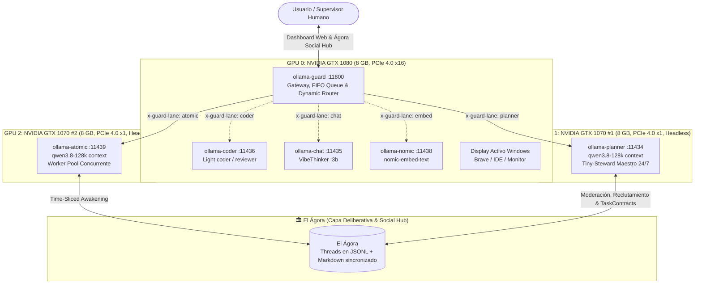

# 00 — Especificación Maestra y Principios Operativos

- **Documento:** Especificación Maestra de la Fábrica Multiagente
- **Estado:** `APROBADO`
- **Última Actualización:** 2026-09-26
- **Autor / Supervisor:** Antigravity Wingman & Tiny-Steward Core Team

---

## 1. Visión y Propósito del Sistema

La **Fábrica Multiagente Autónoma** es un sistema distribuido local diseñado para operar de forma ininterrumpida (24/7/365). Su propósito es ejecutar ciclos comerciales y de análisis de alta autonomía: prospección de nichos de mercado, generación y mantenimiento de tiendas online (Etsy, e-commerce), modelado y renderizado 3D bajo demanda, rastreo de capital institucional ("smart money" e "insider tracking") y despliegue de activos web y de marketing.

### Los Tres Mandatos Cardinales:
1. **Soberanía On-Premise (Zero-Marginal-Cost Baseline):** La rutina operativa continua (lectura, filtrado, parsing, estructuración, redacción base y supervisión) se realiza íntegramente en las 2 GPUs locales. No existen costes recurrentes de API para el funcionamiento basal.
2. **Uso Quirúrgico de Cloud (High-ROI Escalation):** Las llamadas a APIs externas de pago (Anthropic Claude, Google Gemini, OpenAI, Groq, Flux Image API) están estrictamente reguladas por pasarelas de presupuesto y reservadas a tareas donde el impacto económico o la calidad visual justifiquen plenamente el consumo de tokens.
3. **Calidad Auditable & Human-in-the-Loop (HITL):** El Agente Maestro no aprueba ninguna entrega sin evidencia empírica en disco (archivos generados, validaciones de sintaxis, respuestas de test). Cualquier acción irreversible (pago, compra de activos, publicación directa en tienda) requiere aprobación humana explícita.

---

## 2. Asignación y Topología de Cómputo (3 GPUs + Docker Stack Canónico)

La fábrica opera sobre un rig local con 3 GPUs NVIDIA bajo entorno Windows y PowerShell (`pwsh`), gobernado por el stack canónico de Docker con el Gateway inteligente `ollama-guard` en el puerto `11800`:



### Especificación de Roles de Hardware:

| Unidad | Rol Asignado | Parámetros Técnicos | Residencia en Memoria |
| :--- | :--- | :--- | :--- |
| **GPU 1** | **Agente Maestro (Tiny-Steward Orchestrator)** | `ollama-planner` en `:11434` vía `ollama-guard` (:11800). Modelo `qwen3.8-128k` con `thinking: true`, ventana de contexto de 128k tokens. | **Permanente (Hot).** Dedicado 24/7 sin interferencias de pantalla. Latencia inmediata para arbitraje, moderación del Ágora y supervisión. |
| **GPU 2** | **Pool de Workers Concurrente (Línea de Montaje)** | `ollama-atomic` en `:11439` vía `ollama-guard` (:11800). Modelo `qwen3.8-128k` con `thinking: false`, `OLLAMA_NUM_PARALLEL: 2-3` slots concurrentes. Ejecuta micro-tareas y rondas de despertar del Ágora. | **Dinámico / Time-Slicing.** Inferencia ágil para subagentes especializados. |
| **GPU 0** | **Display Windows, Coder, Chat & Embeddings RAG** | `ollama-coder` (:11436), `ollama-chat` (:11435), `ollama-nomic` (:11438) y aceleración de Blender 3D por CUDA. | Compartido con el escritorio del usuario (~1.2 GB ocupado por SO, ~7.0 GB libres). |

---

## 3. Protocolos de Comunicación y Contratos de Tarea

La comunicación entre el Maestro y los Workers rechaza dependencias complejas (Redis, RabbitMQ, Kafka) que suelen ser frágiles en entornos Windows locales. En su lugar, utiliza el sistema ya maduro y probado en el core de Tiny-Steward:

### 3.1. Bus de Mensajería Maildir (`core/mailbox.py`)
- **Directorio de Buzones:** `sessions/.mailbox/<session_id>/inbox/`
- **Operaciones Atómicas:** Escritura en archivo temporal `.tmp` y renombrado atómico `replace()`.
- **Estructura del Mensaje:**
```json
{
  "id": "uuid-v4",
  "from": "worker_scout_01",
  "to": "master_steward",
  "priority": "urgent | high | normal | low",
  "type": "task_result | supervision_question | blocker | alert",
  "content": "Resultado estructurado o descripción del estado",
  "blocking": false,
  "in_reply_to": "uuid-tarea-padre",
  "ts": 1727362000.123,
  "extra": {
    "artifacts": ["c:/ruta/al/entregable.json"],
    "metrics": {"tokens": 1200, "duration_s": 4.5}
  }
}
```
- **Priorización Automática:** En cada drenaje de buzón (`drain()`), los mensajes se procesan en orden: `blocking` ➡️ `priority (urgent > high > normal > low)` ➡️ `timestamp`.

### 3.2. Contrato de Tarea Formal (`core/task_contract.py`)
Ningún worker recibe una instrucción ambigua en lenguaje natural libre. Todo trabajo se despacha como un `TaskContract`:
- **Objetivo (Goal):** Meta explícita y no negociable.
- **Entradas (Inputs):** Rutas de archivos de contexto, parámetros exactos.
- **Restricciones (Constraints):** Límites de tiempo, herramientas permitidas, formato estricto de salida (JSON validado por esquema).
- **Criterio de Aceptación (Validation):** Condición observable que el Maestro comprobará antes de cerrar la tarea (ej. "el archivo `listing.json` debe existir y contener las claves obligatorias: `title`, `tags`, `price`").

---

## 4. Gobernanza de Seguridad y Fronteras de Confianza

### 4.1. ShellGuard (`core/shell_guard.py`)
- Todos los comandos ejecutados por workers en el sistema host son filtrados por el `ShellGuard`.
- **Reglas Estrictas:**
  - Prohibido el uso de comandos destructivos (`rm -rf`, `Format-Volume`, modificaciones del registro del sistema).
  - Restricción de escritura al directorio de trabajo del proyecto o carpetas temporales autorizadas.
  - Toda ejecución se realiza mediante PowerShell (`pwsh`) canónico, respetando las rutas absolutas.

### 4.2. Matriz de Human-in-the-Loop (HITL)

| Tipo de Acción | Nivel de Autonomía | Requiere Aprobación Humana | Mecanismo de Alerta |
| :--- | :--- | :--- | :--- |
| Scraping y recolección de datos públicos | **100% Autónomo** | No | Log en dashboard |
| Generación de modelos 3D y renders | **100% Autónomo** | No | Vista previa en dashboard |
| Redacción de borradores de tiendas (Drafts) | **100% Autónomo** | No | Ficha lista para revisión |
| Publicación en vivo de un listing en Etsy/Web | **Semi-Autónomo** | **SÍ** | Botón de un clic: "Aprobar y Publicar" |
| Compra de dominios o contratación de servicios | **Supervisado** | **SÍ** | Notificación push con desglose de coste |
| Transacción financiera / Movimiento de capital | **Estrictamente Supervisado** | **SÍ (Firma requerida)** | Alerta de alta prioridad con informe de riesgo |

---

## 5. Ciclo de Vida y Recuperación Automática (Auto-Healing)

1. **Heartbeat del Maestro (`idle_loop.py`):**
   - El Maestro ejecuta ciclos de vigilancia cada `tick_interval` (2.0 segundos).
   - Verifica la salud de los procesos de los workers (`pid.is_running()`).
   - Si un worker muere de forma inesperada (código de salida != 0, OOM de VRAM), el Maestro marca la tarea como fallida, archiva el log de error en `lessons.md` y redispara el worker con parámetros de contexto reducidos.
2. **Vigilancia de VRAM y Throttling:**
   - La GPU 1 monitoriza la presión de memoria mediante telemetría. Si la ocupación supera el 92%, las nuevas tareas se encolan en disco hasta que finalicen las ejecuciones en curso.
3. **Consolidación de Aprendizaje (`/dream`):**
   - En periodos de baja carga (madrugada o colas vacías), el Maestro activa la rutina de "sueño" para compactar logs, extraer patrones de éxito y actualizar la base de directivas del sistema.
