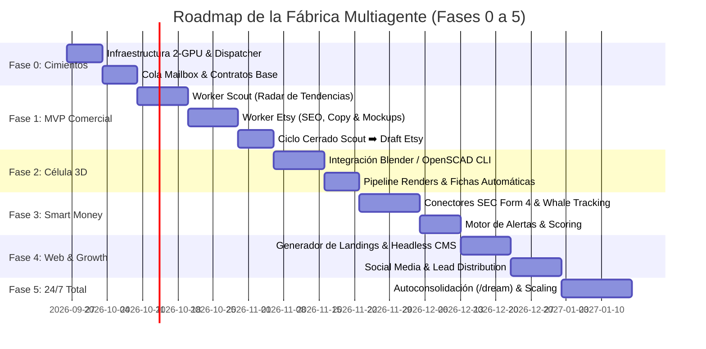

# 01 — Roadmap Estratégico y Fases de Implementación

- **Documento:** Plan de Fases e Hitos de la Fábrica Multiagente
- **Estado:** `PROPUESTA ACTIVA`
- **Fecha:** 2026-09-26
- **Relación:** Sincronizado con [`plans/ROADMAP.md`](file:///c:/Users/soyko/Documents/tiny_steward/plans/ROADMAP.md)

---

## 🗺️ Diagrama de Fases Temporales

---

## 📋 Detalle de Fases e Hitos

### 🟢 Fase 0: Cimientos del Dispatcher y Protocolos de Fábrica
> **Objetivo:** Establecer la infraestructura de comunicación no bloqueante entre GPU 0 y GPU 1 sin añadir dependencias externas frágiles.

- **Hito 0.1:** Verificación y sincronización de scripts de arranque de GPU 0 (`start-qwythos-atomic.ps1`) y GPU 1 (`start-qwythos-server.ps1`).
- **Hito 0.2:** Adaptación de `core/runtime_delegate.py` para soportar pool de workers en cola (FIFO priorizada sobre `core/mailbox.py`).
- **Hito 0.3:** Creación del arquetipo formal `WorkerBase` con ciclo de vida: *Init ➡️ Pull Task ➡️ Execute ➡️ Verify Artifact ➡️ Post Result ➡️ Sleep/Next*.
- **Criterio de Validación:** Un script de prueba lanza 3 workers concurrentes en GPU 1 que reportan sus entregables al buzón del Maestro en GPU 0 en menos de 10 segundos.

---

### 🟢 Fase 1: MVP Comercial — Dúo Scout & Etsy Worker
> **Objetivo:** Generar el primer flujo de valor tangible: detección automática de productos con alta demanda y generación de fichas listas para publicación en Etsy.

- **Hito 1.1 — Worker Scout (Radar):**
  - Implementación de scrapers respetuosos de tendencias (Reddit, Google Trends, Pinterest).
  - Algoritmo de puntuación de oportunidad: `Score = (Volumen_Búsqueda * Margen_Estimado) / Competencia`.
- **Hito 1.2 — Worker E-commerce (Etsy):**
  - Motor de generación de títulos optimizados para el algoritmo de búsqueda de Etsy (140 caracteres, palabras clave en los primeros 40 caracteres).
  - Selector de las 13 etiquetas (tags) con mayor intención de compra.
  - Generador de descripciones comerciales estructuradas (características, dimensiones, instrucciones de uso, FAQ).
- **Hito 1.3 — Pipeline de Mockups Básicos:**
  - Composición de imágenes con plantillas locales (Python Pillow) o llamada al Gateway Cloud para mockups fotorrealistas.
- **Hito 1.4 — Integración con Dashboard:**
  - Visualización de la ficha en el Dashboard web de Tiny-Steward con botón de validación humana.
- **Criterio de Validación:** El sistema genera 3 fichas completas de producto en estado Borrador (`draft_listing.json` + 3 imágenes de mockup) a partir de una palabra clave de tendencia, sin intervención humana hasta la fase de revisión.

---

### 🟡 Fase 2: Célula de Diseño 3D & Activos Procedurales
> **Objetivo:** Automatizar la creación de productos físicos (imprimibles en 3D) o modelos digitales descargables.

- **Hito 2.1 — Motor de Generación Paramétrica:**
  - Conector con **OpenSCAD** para geometrías matemáticas precisas (soportes, organizadores, piezas de encaje).
  - Conector con **Blender Headless** mediante scripts Python para modelado orgánico, remesh y texturizado.
- **Hito 2.2 — Renderizado y Exportación Automática:**
  - Exportación de archivos de producción (`.stl`, `.step`, `.3mf`).
  - Renderizado automático con estudio de iluminación preconfigurado (renders frontal, cenital, detalle y perspectiva).
- **Criterio de Validación:** A partir de un parámetro dimensional, la fábrica produce el modelo 3D validado (sin geometría non-manifold) y 4 renders PNG listos para ser consumidos por el Worker de Etsy.

---

### 🟡 Fase 3: Célula Smart Money & Flujos de Capital
> **Objetivo:** Rastrear y alertar sobre movimientos institucionales e insiders en tiempo real para capitalizar tendencias financieras.

- **Hito 3.1 — Monitor de Insiders (SEC EDGAR Form 4):**
  - Parser del feed RSS/API de la SEC para detectar compras sustanciales en mercado abierto por parte de CEOs/CFOs.
- **Hito 3.2 — Monitor de Ballenas Cripto / On-Chain:**
  - Integración de webhooks y APIs públicas (Arkham, Etherscan) para alertar sobre movimientos anómalos de carteras con alta rentabilidad histórica.
- **Hito 3.3 — Mercados Predictivos (Polymarket):**
  - Monitor de divergencias de probabilidad y liquidez entrante en eventos clave.
- **Hito 3.4 — Motor de Alertas & Conviction Score:**
  - Síntesis de información y emisión de reportes diarios de convicción clasificados por nivel de riesgo.
- **Criterio de Validación:** El sistema genera una alerta en menos de 5 minutos tras una publicación de Form 4 de alta relevancia, con resumen estructurado del impacto.

---

### ⚪ Fase 4: Célula Webmaster, Growth & Marketing Satélite
> **Objetivo:** Crear activos web independientes para captación directa de tráfico y ventas fuera de marketplaces.

- **Hito 4.1 — Generador de Micro-Sitios & Landings:**
  - Plantillas ultrarrápidas (HTML/Vanilla CSS o Astro) desplegadas automáticamente.
- **Hito 4.2 — Programación de Contenidos Sociales:**
  - Generación de hilos, posts visuales e infografías para Twitter/X, Pinterest e Instagram.
- **Hito 4.3 — Lead Capture & Email Automation:**
  - Formularios de captación y entrega de productos digitales/recursos gratuitos.

---

### ⚪ Fase 5: Operación Continua 24/7, Auto-Optimización y Escalado
> **Objetivo:** Máxima estabilidad autónoma con supervisión desatendida.

- **Hito 5.1 — Consolidación de Aprendizaje Nocturno (`/dream`):**
  - Análisis de qué productos tienen más visitas o qué alertas fueron más certeras; actualización de las directivas en `RULES.md`.
- **Hito 5.2 — Balanceador Dinámico de Carga GPU:**
  - Reasignación de recursos en tiempo real según la demanda del día (ej. más slots para 3D por la noche, más slots para Scouting por el día).
