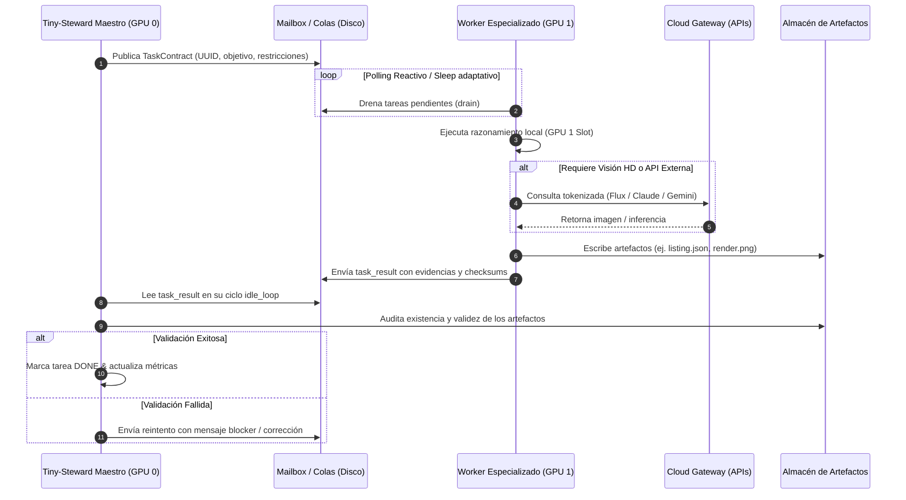

# 02 — Arquitectura Técnica de Bajo Nivel

- **Documento:** Diseño de Ingeniería y Subsistemas de la Fábrica
- **Estado:** `APROBADO`
- **Fecha:** 2026-09-26
- **Tecnologías:** Python 3.11+, Windows PowerShell (`pwsh`), SQLite (WAL), llama.cpp / vLLM, Maildir

---

## 1. Diagrama de Flujo y Subsistemas del Motor



---

## 2. Subsistema de Despacho y Colas (Factory Dispatcher)

El Dispatcher no es un servicio pesado independiente; es un módulo embebido en el `ServiceKernel` de Tiny-Steward que corre en el contexto de **GPU 0**.

### 2.1. Estructura de Directorios de Trabajo
```text
tiny_steward/
├── sessions/
│   ├── .mailbox/
│   │   ├── master/inbox/             # Buzón central del Maestro
│   │   ├── worker_scout/inbox/       # Buzón del Scout
│   │   ├── worker_etsy/inbox/        # Buzón de E-commerce
│   │   ├── worker_smartmoney/inbox/  # Buzón de Capital
│   │   └── worker_3d/inbox/          # Buzón de Modelado
│   └── fabrica_state.db              # Base de datos de estado SQLite (WAL)
├── fabrica/                          # Documentación y especificaciones
└── storage/
    ├── drafts/                       # Fichas y listings pendientes de revisión
    ├── 3d_models/                    # Archivos STL / OBJ / Blend
    ├── renders/                      # Imágenes de producto y mockups
    └── reports/                      # Boletines de inteligencia y mercado
```

### 2.2. Esquema de Base de Datos de Estado (`fabrica_state.db`)
Para consultas rápidas y telemetría sin escanear carpetas:
```sql
CREATE TABLE IF NOT EXISTS tasks (
    id TEXT PRIMARY KEY,
    worker_type TEXT NOT NULL,
    priority TEXT NOT NULL, -- urgent, high, normal, low
    status TEXT NOT NULL,   -- pending, assigned, running, done, error, cancelled
    contract_json TEXT NOT NULL,
    created_at REAL NOT NULL,
    started_at REAL,
    completed_at REAL,
    result_json TEXT,
    retry_count INTEGER DEFAULT 0
);

CREATE TABLE IF NOT EXISTS worker_nodes (
    worker_id TEXT PRIMARY KEY,
    worker_type TEXT NOT NULL,
    gpu_slot INTEGER,
    pid INTEGER,
    last_heartbeat REAL NOT NULL,
    status TEXT NOT NULL    -- idle, busy, crashed
);
```

---

## 3. Asignación y Control de Recursos GPU

### 3.1. Configuración de Inferencia en GPU 0 (Maestro)
- **Script:** [`start-qwythos-atomic.ps1`](file:///c:/Users/soyko/Documents/Ollama/docker/llamacpp/start-qwythos-atomic.ps1)
- **CUDA Device:** `0`
- **Puerto:** `11800` (o secundario dedicado)
- **Modelo:** Qwen 2.5 14B / 32B Instruct cuantizado Q4_K_M / Q5_K_M.
- **Contexto:** 32k - 128k tokens con caché de prompt activa (`--cache-prompt`).
- **Comportamiento:** Siempre en VRAM. No compite por recursos con los workers.

### 3.2. Configuración de Inferencia en GPU 1 (Worker Pool)
- **Script:** [`start-qwythos-server.ps1`](file:///c:/Users/soyko/Documents/Ollama/docker/llamacpp/start-qwythos-server.ps1)
- **CUDA Device:** `1`
- **Puerto:** `11801`
- **Modelo:** Qwen 2.5 7B / 14B Instruct o servidor vLLM con endpoints OpenAI compatibles.
- **Paralelismo:** `--parallel 2` a `4` slots concurrentes, permitiendo que varios workers operen simultáneamente sin bloquearse.

### 3.3. Monitor de Salud de GPU (VRAM Watchdog)
Un hilo ligero en PowerShell o Python consulta periódicamente `nvidia-smi` para evitar Out-Of-Memory (OOM):
```powershell
# Consulta de VRAM en pwsh
nvidia-smi --query-gpu=index,memory.used,memory.total,temperature.gpu --format=csv,noheader,nounits
```
- **Umbral de Alerta:** Si VRAM > 92%, el Dispatcher retiene el inicio de nuevos workers hasta que se libere un slot.
- **Umbral Térmico:** Si temperatura > 82°C, se introduce un retardo (backoff) en los turnos de inferencia.

---

## 4. Ciclo de Vida de un Worker (`WorkerLifecycle`)

Cada worker hereda de una clase base robusta que implementa el siguiente autómata de estados:

1. **BOOT:** Carga de configuración, verificación de conexión con el backend de GPU 1 y apertura de su Mailbox.
2. **LISTEN:** Espera pasiva de mensajes en `sessions/.mailbox/<worker_name>/inbox/`. Si no hay mensajes, duerme en intervalos adaptativos (0.5s a 5s).
3. **CLAIM:** Al recibir un mensaje de tarea, lo marca atómicamente en la base de datos de estado para evitar colisiones.
4. **EXECUTE:** Ejecuta el bucle de razonamiento y herramientas autorizado bajo las restricciones del `TaskContract`.
5. **VERIFY:** Comprueba de forma autónoma que el entregable cumple con las especificaciones antes de entregarlo.
6. **REPORT:** Envía el resultado al buzón del Maestro con tipo `task_result` y metadatos de telemetría.
7. **RECYCLE / REARM:** Limpia archivos temporales y regresa al estado **LISTEN**.

---

## 5. Tolerancia a Fallos y Manejo de Errores

| Tipo de Fallo | Detección | Acción de Auto-Recuperación |
| :--- | :--- | :--- |
| **Worker Colgado / Proceso Zombi** | No hay latido en `fabrica_state.db` tras `timeout_s` (ej. 300s). | El Maestro ejecuta `Stop-Process -Id <pid>` forzado, libera el slot y reasigna la tarea a un nuevo worker con `retry_count += 1`. |
| **Error de Sintaxis / JSON Corrupto** | `json.JSONDecodeError` al leer un entregable o mensaje. | El archivo se mueve a `.quarantine` y se notifica al worker para que regenere la salida respetando el esquema. |
| **Bloqueo de Scraper / Red Caída** | Excepción de red (`TimeoutError`, `HTTP 429`). | Estrategia de retroceso exponencial (Exponential Backoff con Jitter) y rotación de agentes de usuario / proxy si aplica. |
| **OOM de VRAM en GPU 1** | Código de salida del backend con error de asignación CUDA. | Reinicio automático del servidor de GPU 1 mediante PowerShell y reducción del tamaño de contexto asignado por slot. |
