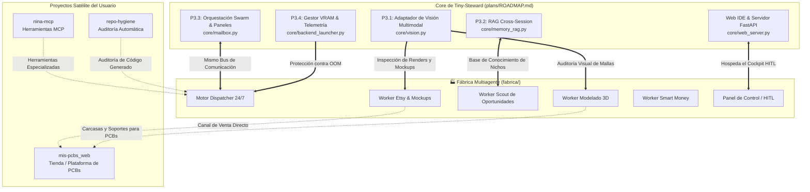

# 04 — Sincronización con Desarrollos Paralelos del Ecosistema

- **Documento:** Matriz de Sinergias y Conexión con Proyectos Paralelos
- **Estado:** `APROBADO`
- **Fecha:** 2026-09-26
- **Propósito:** Evitar silos y maximizar la reutilización del código existente en Tiny-Steward y proyectos satélite

---

## 🔄 Visión de Ecosistema Integrado

La Fábrica Multiagente no es un proyecto aislado; se nutre y alimenta directamente los desarrollos activos de **Tiny-Steward** y los proyectos satélites del usuario.

---

## 🧩 1. Sincronización con el Roadmap Activo de Tiny-Steward

Referencia canónica: [`plans/ROADMAP.md`](file:///c:/Users/soyko/Documents/tiny_steward/plans/ROADMAP.md).

### 1.1. P3.1: Adaptador de Visión Multimodal (`core/vision.py`)
- **Desarrollo Paralelo:** Tiny-Steward está incorporando enrutamiento dinámico para imágenes (`.png`, `.jpg`, `.webp`) hacia modelos multimodales locales o de respaldo.
- **Sinergia con la Fábrica:**
  - El **Worker E-commerce (Etsy)** lo utiliza para evaluar la calidad estética de los mockups generados antes de marcarlos como listos.
  - El **Worker 3D** lo utiliza para comprobar que los renders de Blender no tengan artefactos de luz o geometrías rotas.

### 1.2. P3.2: Síntesis de Conocimiento Cross-Session (`core/memory_rag.py`)
- **Desarrollo Paralelo:** Indexación vectorial unificada de memorias históricas (`sessions/*/*.memory.md` y `memory/*.md`).
- **Sinergia con la Fábrica:**
  - Permite que los descubrimientos del Worker Scout persistan a lo largo de semanas y meses.
  - Si el Scout descubrió hace 3 meses que los "soportes de soldador retro" tenían alta demanda, el Worker Etsy y el Worker 3D pueden consultar esa memoria histórica sin necesidad de re-escanear todo desde cero.

### 1.3. P3.3: Swarm Multiproceso y Paneles Distribuidos (`core/runtime_loop.py`, `core/mailbox.py`)
- **Desarrollo Paralelo:** Escalado de delegación de subprocesos en segundo plano con despertar reactivo por `Mailbox`.
- **Sinergia con la Fábrica:**
  - Es exactamente el motor que alimenta la cola de workers en GPU 1. Todo avance en `core/mailbox.py` beneficia directamente la latencia y la robustez de la fábrica.

### 1.4. P3.4: Gestor de Memoria GPU & Telemetría en Tiempo Real
- **Desarrollo Paralelo:** Monitorización de `nvidia-smi` y transmisión de uso de VRAM vía Server-Sent Events (SSE) al Web IDE.
- **Sinergia con la Fábrica:**
  - Proporciona la capa de protección para garantizar que los workers concurrentes en GPU 1 no saturen la VRAM ni provoquen caídas del servidor local de inferencia.

---

## 🛰️ 2. Sincronización con Proyectos y Repositorios Satélite

### 2.1. Proyecto Satélite: `mis-pcbs_web`
- **Contexto:** En el historial de sesiones del usuario figura el desarrollo de [`mis-pcbs_web`](file:///c:/Users/soyko/Documents/tiny_steward/sessions/mis-pcbs_web/mis-pcbs_web.json), un entorno enfocado en electrónica y PCBs.
- **Sincronización:**
  - **Worker 3D:** Puede generar cajas protectoras, carcasas personalizadas y soportes mecánicos paramétricos para las placas de circuito de `mis-pcbs_web`.
  - **Worker E-commerce:** Puede abrir un canal de venta en Etsy o Shopify para accesorios complementarios de PCBs (kits de montaje, cajas de inyección o impresión 3D).

### 2.2. Proyecto Satélite: Herramientas `nina-mcp`
- **Contexto:** En [`config.yaml`](file:///c:/Users/soyko/Documents/tiny_steward/config.yaml) ya existe un cliente MCP configurado:
  `C:\Users\soyko\Documents\nina-mcp\test_client.py` con su entorno virtual.
- **Sincronización:**
  - Las capacidades de control y automatización expuestas por el servidor MCP de NINA pueden registrarse como herramientas nativas (`primitives`) para los workers de la fábrica (por ejemplo, para automatización de escritorio, control de navegadores o captura de métricas).

### 2.3. Proyecto Satélite: `repo-hygiene`
- **Contexto:** El usuario cuenta con herramientas de revisión y calidad de repositorio (`ai_reviewer.py`).
- **Sincronización:**
  - Los scripts de generación 3D (Blender Python) y el código de landings generado por el Worker Web se pasan por el pipeline de `repo-hygiene` antes de ser ejecutados o desplegados en producción.

---

## 📊 Matriz de Integración en el Dashboard Unificado

El servidor web de Tiny-Steward ([`core/web_server.py`](file:///c:/Users/soyko/Documents/tiny_steward/core/web_server.py)) hospedará una pestaña dedicada a la fábrica:

1. **Monitor de Línea de Producción:** Estado de cada slot de GPU 1 (Worker activo, tarea actual, tiempo de ejecución).
2. **Bandeja de Entrada HITL:** Lista de productos y alertas pendientes de validación humana con botones de aprobación de un clic.
3. **Contador de Rendimiento Económico:** Estimación de ingresos proyectados vs coste de tokens cloud consumidos.
