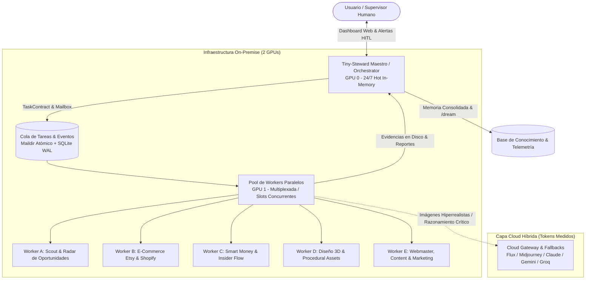

# 🏭 Fábrica Multiagente Autónoma 24/7 (Tiny-Steward Engine)

> **Centro de Mando, Especificación Maestra, Decisiones de Diseño y Sincronización Estratégica.**

Este directorio centraliza toda la documentación, especificaciones técnicas, decisiones arquitectónicas y sincronización de desarrollos para la **Fábrica Multiagente Autónoma On-Premise 24/7**.

La fábrica opera bajo la dirección de **Tiny-Steward como Agente Maestro / Director de Operaciones**, orquestando un pool de **agentes trabajadores especializados** sobre una infraestructura local de **2 GPUs dedicadas**, complementada con un **Gateway Cloud Híbrido** para tareas de alta precisión y valor añadido.

---

## 🗺️ Mapa de Documentación y Guía de Navegación

| Documento | Enlace | Propósito y Contenido Clave |
| :--- | :--- | :--- |
| **00. Especificación Maestra** | [`00_ESPECIFICACION_MAESTRA.md`](file:///c:/Users/soyko/Documents/tiny_steward/fabrica/00_ESPECIFICACION_MAESTRA.md) | Documento canónico: Principios, topología de cómputo, reparto de GPUs, gobernanza y salvaguardas (HITL, ShellGuard). |
| **01. Roadmap & Fases** | [`01_ROADMAP_Y_FASES.md`](file:///c:/Users/soyko/Documents/tiny_steward/fabrica/01_ROADMAP_Y_FASES.md) | Hoja de ruta por fases (Fase 0 a Fase 5), hitos entregables, dependencias y criterios de éxito. |
| **02. Arquitectura Técnica** | [`02_ARQUITECTURA_TECNICA.md`](file:///c:/Users/soyko/Documents/tiny_steward/fabrica/02_ARQUITECTURA_TECNICA.md) | Diseño de bajo nivel: Bus de eventos Maildir, colas de tareas, slots paralelos, ciclo de vida del worker y watchdog. |
| **03. Células de Trabajo (Workers)** | [`03_CELULAS_Y_WORKERS.md`](file:///c:/Users/soyko/Documents/tiny_steward/fabrica/03_CELULAS_Y_WORKERS.md) | Detalle de cada trabajador: Scout/Radar, Etsy/Shopify, Smart Money/Insider, Diseño 3D/Renders y Web/Marketing. |
| **04. Sincronización de Desarrollos** | [`04_SINCRONIZACION_DESARROLLOS_PARALELOS.md`](file:///c:/Users/soyko/Documents/tiny_steward/fabrica/04_SINCRONIZACION_DESARROLLOS_PARALELOS.md) | Alineación y sinergia con el Roadmap de Tiny-Steward (P3 Visión, Cross-Session RAG, Telemetría GPU, Web IDE y proyectos satélite). |
| **05. Registro de Decisiones (ADR)** | [`05_REGISTRO_DECISIONES_ADR.md`](file:///c:/Users/soyko/Documents/tiny_steward/fabrica/05_REGISTRO_DECISIONES_ADR.md) | Decisiones arquitectónicas fundamentales justificadas (ADR-001 a ADR-005): por qué local-first, por qué Maildir, por qué 2 GPUs asimétricas. |

---

## 🏛️ Esquema Conceptual de la Fábrica

---

## ⚡ Estado Actual del Proyecto

- **Fase Activa:** `Fase 0: Cimientos del Dispatcher & Contratos`
- **Infraestructura:** 2 GPUs configuradas en [`config.yaml`](file:///c:/Users/soyko/Documents/tiny_steward/config.yaml) (`GPU 0` Qwythos Atomic / `GPU 1` Qwythos Server).
- **Próximo Hito Clave:** Puesta en marcha del primer pipeline vertical: **Scout de Tendencias ➡️ Ficha de Producto Etsy con Mockup**.
