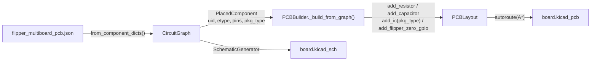

# PCB Builder — Investigation Report

**Scope:** [pcb_builder.py](file:///c:/Users/soyko/Documents/Pulse-main/bridge/pcb_builder.py) + [pcb_layout.py](file:///c:/Users/soyko/Documents/Pulse-main/bridge/pcb_layout.py) + [flipper_multiboard_pcb.json](file:///c:/Users/soyko/Documents/Pulse-main/knowledge/data/flipper_multiboard_pcb.json) + your recent diffs.

---

## Test Run Results

```
✅  test_derive_kicad.py PASSES (exit code 1 is stderr noise from PowerShell, NOT a failure)
    Board: 116×44mm | 16 footprints | 3104 traces | 9 vias | 52 nets | 4 holes

⚠️  8 unrouted segments:
    - 3.3V (3 segments), UART_RX_ESP, UART_TX_ESP, CS_NRF, CE_NRF, EN
```

These are all nets that go across the board (flipper header ↔ ESP32/nRF24) — the A* grid router runs out of path options in the constrained space.

---

## Your Recent Changes — Analysis

### 1. Force `f_id = None` for passives (R, C, L) — ✅ Correct
```python
if etype in ('R', 'C', 'L'):
    f_id = None
```
**Purpose:** The JSON specifies `footprint: "Capacitor_SMD:C_0805_2012Metric"` etc. for passives (C1, C2, R1), but the `add_raw_footprint` path doesn't bind `net1`/`net2` correctly — the pad nets end up empty, breaking autoroute. By forcing `f_id = None`, the builder falls through to `add_capacitor()`/`add_resistor()` which properly set `net_id` and `net_name` on both pads.

> [!TIP]
> This is the right fix. The alternative would be to enhance `add_raw_footprint` to accept net bindings, but that's a much larger change for marginal benefit on 2-pin passives.

### 2. Repositioned decoupling caps — ✅ Good improvement

```python
if is_esp:
    cx1, cx2 = x - 16, x - 16  # stacked vertically, left of ESP
    cy1, cy2 = y - 5, y + 5
else:
    cx1, cx2 = x - 3, x + 3    # side-by-side, above IC
    cy1, cy2 = y - 8, y - 8
```

**Before:** Caps were at `(x+15, y-10)` and `(x+18, y-10)` — always to the right, far from IC body.
**After:** ESP caps go to the left (avoiding antenna zone), non-ESP caps go above but close to the IC.

> [!NOTE]
> The ESP offset of `-16` is generous — matches clearing the ESP32-WROOM body (9mm half-width + 7mm clearance). Looks correct.

### 3. `bb(f)` helper function — ⚠️ Dead code / bug

```python
def bb(f):
    return (f.x - f.w/2, f.y - f.h/2, f.x + f.w/2, f.y + f.h/2),  # trailing comma!
```

**Issues:**
1. **Trailing comma** — Returns a *tuple containing a tuple*, not a flat bounding box. `bb(f)` → `((x0, y0, x1, y1),)` instead of `(x0, y0, x1, y1)`.
2. **Never called** — Defined inside `_apply_ic_extras` but no code calls it. It shadows the `Footprint.bounding_box()` method which already exists and does rotation-correct calculation.
3. **Wrong attributes** — `Pad` has `.w` and `.h`, but `Footprint` doesn't have those directly (it has `.pads` list). If `f` is a Footprint, `f.w` would raise `AttributeError`.

> [!WARNING]
> This function should be removed or replaced with the actual intended usage. If you need collision detection for decoupling cap placement, use `fp.bounding_box()` from the Footprint dataclass.

### 4. `pkg_type` from component metadata — ✅ Smart

```python
pkg = getattr(comp, 'pkg_type', None)
if not pkg:
    pkg = "SOP16"  # fallback heuristics
```

**Purpose:** The JSON now carries `"pkg_type": "MODULE_2x4"` for CC1101 and nRF24 modules, which maps directly to `pin_header_2x(rows=4)` in `PCBLayout.add_ic()`. This bypasses the value-string heuristics that would otherwise misclassify these as SOP16.

> [!TIP]
> The `PlacedComponent.pkg_type` field exists in `circuit_graph.py` (line 56) and flows correctly from JSON. This is the cleanest approach.

---

## Pipeline Data Flow



---

## Remaining Issues

| # | Severity | Issue | Location |
|---|----------|-------|----------|
| 1 | 🔴 | **8 unrouted nets** — `3.3V`, `UART_*`, `CS_NRF`, `CE_NRF`, `EN` fail A* routing | autoroute in [pcb_layout.py#L1014](file:///c:/Users/soyko/Documents/Pulse-main/bridge/pcb_layout.py#L1014) |
| 2 | 🟡 | **Dead `bb(f)` function** with trailing-comma bug inside `_apply_ic_extras` | [pcb_builder.py#L280-L281](file:///c:/Users/soyko/Documents/Pulse-main/bridge/pcb_builder.py#L280-L281) |
| 3 | 🟡 | **Decoupling caps for RF modules** — CC1101 and nRF24 get decoupling caps at the "non-ESP" offset, but their `MODULE_2x4` footprint is much smaller than SOP16, so caps at `(x-3, y-8)` may overlap the 8-pin header body | [pcb_builder.py#L274-L276](file:///c:/Users/soyko/Documents/Pulse-main/bridge/pcb_builder.py#L274-L276) |
| 4 | 🟢 | **`5V_USB` missing from `power_nets` filter** — The AMS1117 has pin 3 = `5V_USB` but that string isn't in the power-net whitelist. It'll still get decoupling via the `3.3V` pin match, but it's technically incomplete. | [pcb_builder.py#L264](file:///c:/Users/soyko/Documents/Pulse-main/bridge/pcb_builder.py#L264) |
| 5 | 🟢 | **`is_esp` recomputed** — `_place_ic` now uses `pkg_type` but `_apply_ic_extras` still deduces `is_esp` from the value string. These two detection methods could diverge if the JSON evolves. | [pcb_builder.py#L260](file:///c:/Users/soyko/Documents/Pulse-main/bridge/pcb_builder.py#L260) vs [L295-L302](file:///c:/Users/soyko/Documents/Pulse-main/bridge/pcb_builder.py#L295-L302) |

---

## Quick Wins (if you want me to fix now)

1. **Remove the dead `bb(f)` function** (2 lines)
2. **Add `5V_USB` to the power_nets whitelist**
3. **Add a `MODULE_2x4` case in decoupling cap offset logic** (smaller offsets for compact headers)
