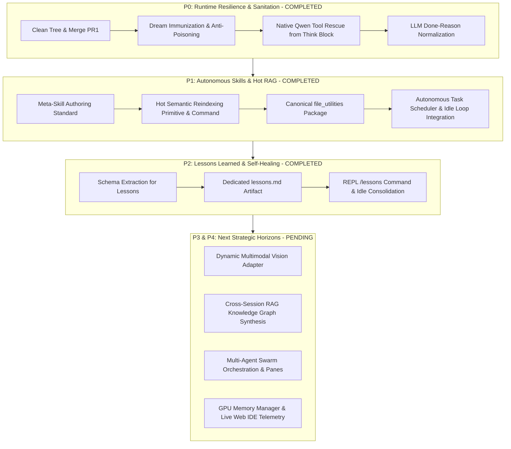

# Tiny Steward — Master Architecture Roadmap & Pending Plans Registry

This document serves as the single source of truth for all architectural milestones, completed capabilities, active mechanisms, and pending roadmap features in **Tiny Steward**.

---

## 🗺️ High-Level Milestone Overview

---

## 📊 Status Matrix

| Component / Plan | Document Reference | Status | Test Coverage |
| :--- | :--- | :--- | :--- |
| **P0: Base Resilience & Truncation Guards** | [`master_architecture_improvement_plan.md`](./master_architecture_improvement_plan.md) | ✅ Completed | 186/186 |
| **P1: Autonomous Skills & Hot RAG** | [`autonomous_skills_rag_and_dream_scheduler_plan.md`](./autonomous_skills_rag_and_dream_scheduler_plan.md) | ✅ Completed | 190/190 |
| **P2: Lessons Learned & Reflection** | [`autonomous_skills_rag_and_dream_scheduler_plan.md`](./autonomous_skills_rag_and_dream_scheduler_plan.md) | ✅ Completed | 191/191 |
| **Multi-Provider Fallback Engine** | [`llm_fallback_and_extensions_plan.md`](./llm_fallback_and_extensions_plan.md) | ✅ Completed | Integrated in `core/providers/` |
| **Web IDE & Telemetry Platform** | [`web_ide_architecture_plan.md`](./web_ide_architecture_plan.md) | 🟡 Active Core | FastAPI server in `core/web_server.py` |
| **Dynamic Multimodal Vision Adapter** | Horizon Item #1 (below) | ⏳ Pending | To be scheduled |
| **Cross-Session Knowledge Synthesis** | Horizon Item #2 (below) | ⏳ Pending | To be scheduled |
| **Multi-Agent Panes & Swarm Mailbox** | Horizon Item #3 (below) | ⏳ Pending | Reference in `archive/` |

---

## 📌 Detailed Pending Roadmap Items

### 1. Dynamic Multimodal Vision Adapter & Image Grounding
- **Objective:** When visual files (`.png`, `.jpg`, `.webp`) or screenshots are attached via `/image` or generated by tools, route them automatically to the vision lane if available (or generate textual grounding metadata).
- **Target Files:** `core/vision.py`, `core/system_prompt.py`, `core/runtime_meta.py`.
- **Key Deliverables:**
  - Dynamic fallback to text-only OCR or descriptive bounding-box metadata if multimodal backend is disabled.
  - Snapshot tool for capturing live web or GUI panes into the vision pipeline.

### 2. Cross-Session RAG Knowledge Graph Synthesis
- **Objective:** Enable Tiny Steward to query across past memories (`sessions/*/*.memory.md` and `memory/*.md`) when solving complex problems across projects.
- **Target Files:** `core/help_engine.py`, `core/memory_rag.py`.
- **Key Deliverables:**
  - Unified vector indexing of both `skills/` and consolidated `sessions/` memories.
  - Hybrid lexical + semantic ranking for past lessons and domain insights.

### 3. Multi-Agent Delegation Swarm & Distributed Panes
- **Objective:** Scale `delegate(agent, task)` into background worker panes with concurrent execution, streaming progress via `core/mailbox.py`.
- **Target Files:** `core/runtime_loop.py`, `core/mailbox.py`, `core/web_server.py`.
- **Key Deliverables:**
  - Micro-agents run in non-blocking background workers.
  - Mailbox notifications trigger reactive wakeups in the main orchestrator without polling.

### 4. GPU VRAM Manager & Real-Time IDE Telemetry
- **Objective:** Monitor NVML / `nvidia-smi` allocations and automatically coordinate LLM context offloading when running concurrent local models.
- **Target Files:** `core/backend_launcher.py`, `web/js/components/telemetry.js`.
- **Key Deliverables:**
  - Real-time VRAM telemetry streamed via SSE to Web IDE.
  - Dynamic context size throttling if VRAM pressure exceeds 90%.

---

## 📁 Plan Directory Organization

- [`ROADMAP.md`](./ROADMAP.md): Master roadmap and status matrix (this document).
- [`autonomous_skills_rag_and_dream_scheduler_plan.md`](./autonomous_skills_rag_and_dream_scheduler_plan.md): Canonical skills, hot RAG index, and scheduler architecture.
- [`master_architecture_improvement_plan.md`](./master_architecture_improvement_plan.md): 5-pillar master blueprint.
- [`llm_fallback_and_extensions_plan.md`](./llm_fallback_and_extensions_plan.md): Multi-provider resilient client.
- [`web_ide_architecture_plan.md`](./web_ide_architecture_plan.md): Web UI & Agent IDE platform.
- [`archive/`](./archive/): Retired historical iterations and early drafts.
