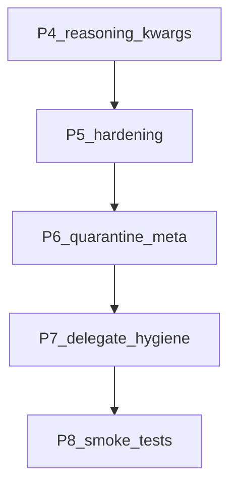

# Próximo trabajo — Tiny Steward (P4–P8) ✅ CERRADO

**Origen:** snapshot del plan multiphase `delegate_panes_mailbox` (2026-07-16).  
**Referencia completa:** [`referencia-delegate-panes-mailbox.md`](referencia-delegate-panes-mailbox.md)  
**Siguiente ciclo:** [`fuera-de-alcance.md`](fuera-de-alcance.md) (F1+)

P0–P8 **hechos**. Este archivo queda como registro del ciclo P4–P8.



---

## Orden

1. P4 — reasoning / chat_template_kwargs / thinking_budget  
2. P5 — hardening post-auditoría  
3. P6 — cuarentena OpenClaw `_meta`  
4. P7 — higiene de `delegate`  
5. P8 — smoke tests de primitivas  

---

## P4 — Reasoning / chat template Qwythos + presupuesto

### Problema

- Jinja soporta `enable_thinking`, `preserve_thinking`, `reasoning_content`; Steward no envía `chat_template_kwargs`.
- `/set thinking` cae en `extra_params` plano (incorrecto).
- `normalize_messages_for_llm` strippea `<think>` hacia el LLM sin persistencia paralela.
- Stream solo lee `delta.content`.

### Decisiones

1. Body estable por sesión:
   ```json
   "chat_template_kwargs": {
     "enable_thinking": true,
     "preserve_thinking": false
   },
   "thinking_budget_tokens": -1,
   "cache_prompt": true
   ```
   Defaults `config.yaml`:
   - orchestrator: thinking on, budget `-1`
   - atomic: thinking off, budget `0` (TTFT en micro-agentes)

2. No togglear kwargs mid-session sin warn de LCP/KV.
3. Persistir assistant **raw** en `session.json`; strip solo en normalize; mirror `sessions/<name>.think.jsonl`.
4. Stream: `delta.reasoning_content` + content; display dim.
5. `/set enable_thinking|preserve_thinking|thinking_budget_tokens` cableados bien.
6. Tabla KV-safe en `core/README.md` (ver apéndice en referencia).

### Archivos

- `core/llm.py`, `core/runtime.py`, `config.yaml`, `core/README.md`, tests

---

## P5 — Hardening post-auditoría

1. `write`/`append` → `attrs.get("path") or body`
2. Recortar SYSTEM_PROMPT a **un** ejemplo `<tool_call>`; tools once (cada resend rompe LCP)
3. Flag `Runtime._is_delegate_child` (no inferir solo con `metadata.parent`)
4. Mailbox: log JSON corrupto; no borrar `delegate_result` en drain genérico; cap bytes; `blocking` primero
5. Spawn fail-fast (`poll` muerto → error); no fallback post-provision de child huérfano
6. Retirar `core/micro_agent.py` del path vivo
7. Limpiar `_THINK_RE` muerto en display (think visible)
8. Nota ops: `id_slot` por child solo cuando `--parallel N>1` (ver fuera de alcance)

---

## P6 — Cuarentena `skills/_meta` OpenClaw

Excluir del index (sin borrar disco):

- `delegation-gate`, `delegate-router`, `pulse-routing`, `nomic-local`, `paid-bash-security-v1-1`

Mantener: `primitives/`, `troubleshooting/`.  
Tras cambio: `--build-index`; verificar que `help("delegation")` no surfaca OpenClaw.

---

## P7 — Higiene de `delegate`

Síntoma (sesión `minor-ui-review`): task = literal del SYSTEM_PROMPT (`Review the Acme NDA text below...`).

1. Quitar/acortar ejemplo delegate del prompt (schema basta)
2. Error si problem vacío o igual al stub del ejemplo
3. Task debe ser enunciado completo (texto o path)

---

## P8 — Smoke tests

`tests/test_primitives_smoke.py`:

- `ls` / `mkdir` / `write` / `read` en tempdir
- `pwsh` `Write-Output 'ok'`
- `python` `print("hello_world 🎉 ñ")` exit 0

Sin backends LLM.

---

## Checklist todos

- [x] p4-reasoning-kwargs  
- [x] p5-hardening-debt  
- [x] p6-quarantine-openclaw-meta  
- [x] p7-delegate-task-hygiene  
- [x] p8-primitive-smoke-tests  
