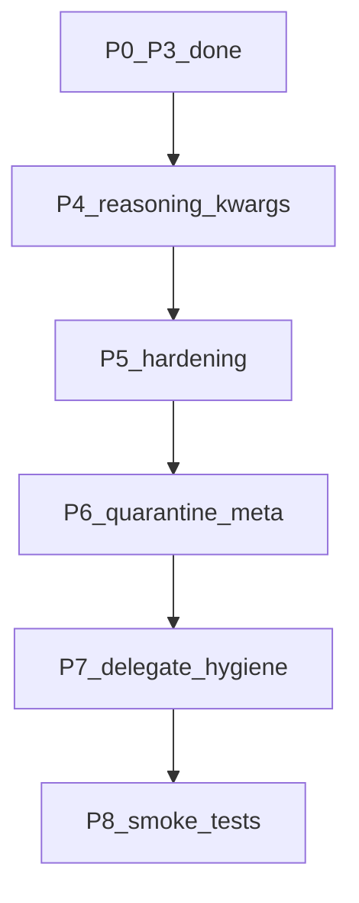
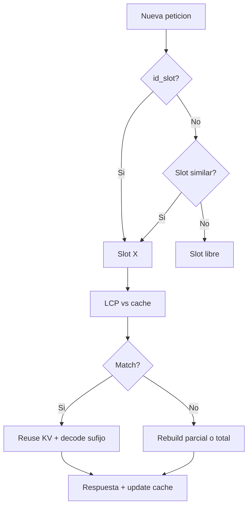

# Delegación observable + backlog post-auditoría

## Estado (2026-07-16 → cerrado P0–P8)

**P0–P8 completados** (tests unitarios verdes; OpenClaw `_meta` sin leaks en index live).  
Siguiente ciclo: [`fuera-de-alcance.md`](fuera-de-alcance.md) (fases F1+).

## Estado histórico (2026-07-16)

Fuentes cruzadas:

- Implementación P0–P3 en repo (código + tests verdes)
- Auditoría de acoplamientos / fallos silenciosos (sesión Cursor)
- [`sessions/qwythos-review.md`](sessions/qwythos-review.md) (contribución directa Qwythos — corregir: **503 en stream ya está**; no reabrir)
- Sesión [`minor-ui-review`](sessions/minor-ui-review.json) + hijo `...__nda-review_4352c453` (delegate con task = ejemplo del SYSTEM_PROMPT)
- Chat template Qwythos (Jinja): `enable_thinking`, `preserve_thinking`, `reasoning_content`, `tools` → `<tool_response>`
- Referencia parámetros llama-server (sampling / prompt / slots / reasoning / ctx) — **Apéndice A**; implica KV-safe vs KV-breaking para P4/P5



---

## Hecho — P0–P3 (no reabrir salvo regresión)

| ID | Qué quedó hecho |
|---|---|
| P0 | `ls`/`mkdir` attrs.path; Path not found; SYSTEM_PROMPT nativo; benign FS no-resend; 503 stream; tests dispatch/parsing |
| P1 | [`core/mailbox.py`](core/mailbox.py); drain entre turnos; `/mail` |
| P2 | [`core/delegate_terminal.py`](core/delegate_terminal.py); CLI `--delegate-mode`; wait bloqueante; `/tree` |
| P3 | Notas en [`config.yaml`](config.yaml) / [`core/README.md`](core/README.md): atomic `--parallel 1`, `-c 98304` |

Correcciones al contexto **viejo** del plan original (ya obsoleto):

- Streaming del delegate **sí** existe (mismo pane / hijo).
- Retry 503 en stream **sí** está en [`core/llm.py`](core/llm.py) (`_stream_request`).
- Protocolo canónico en prompt ya es `<tool_call>` (sigue dual con `body.tools` — deuda P5).

---

## P4 — Reasoning / chat template Qwythos + presupuesto (prioridad)

Problema verificado: el Jinja soporta controles que Tiny Steward **no envía**; `/set thinking` cae en `extra_params` plano (no es `chat_template_kwargs`); `normalize_messages_for_llm` strippea `<think>` hacia el LLM sin archivo/`reasoning_content` paralelo; el stream solo lee `delta.content`.

Referencia completa de parámetros llama-server: **Apéndice A** (abajo). Implicaciones clave para P4:

- `chat_template_kwargs` **sí** cambia tokens del prompt → **invalida / acorta LCP** si se togglean entre turnos.
- `thinking_budget_tokens` / CLI `--reasoning-budget` **no** cambian el prompt → **KV reutilizable** (seguro togglear).
- Sampling (`temperature`, `top_p`, `repeat_penalty`, …) **no** invalidan KV.
- `tools` en el body **sí** afecta el prompt renderizado → la política “send tools once” de Tiny Steward **protege el LCP**; reenviar tools a menudo es caro (reforzar en P5).
- `cache_prompt: true` (default server) debe permanecer **estable** en el cliente; no enviar `false` salvo debug explícito.
- Con atomic `--parallel 1`, un solo slot: LCP importa más que nunca entre turnos del mismo hijo.

### Decisiones fijadas

1. Request body siempre incluye (valores desde config, estables por sesión):
   ```json
   "chat_template_kwargs": {
     "enable_thinking": true,
     "preserve_thinking": false
   },
   "thinking_budget_tokens": -1,
   "cache_prompt": true
   ```
   Defaults en `config.yaml`:
   - orchestrator: `enable_thinking: true`, `preserve_thinking: false`, `thinking_budget_tokens: -1`
   - atomic: `enable_thinking: false`, `preserve_thinking: false`, `thinking_budget_tokens: 0` (o `-1` si se quiere think en atomic — **default false/0** para TTFT en micro-agentes)

2. **No togglear** `enable_thinking` / `preserve_thinking` mid-session sin aceptar rotura de LCP. `/set` los cambia y loguea warn “KV prefix may invalidate”.

3. Persistencia: assistant **raw** en `session.json` (con `<think>` en content si vino ahí, o campo `reasoning_content` si el stream lo separó). Strip **solo** en `normalize_messages_for_llm`. Mirror append-only: `sessions/<name>.think.jsonl`.

4. Stream: acumular `delta.reasoning_content` + `delta.content`; display dim para reasoning; no duplicar si ya viene en tags.

5. `/set enable_thinking|preserve_thinking|thinking_budget_tokens` → dicts correctos en el cliente (`chat_template_kwargs` vs top-level). Eliminar fallback engañoso de clave suelta `thinking`.

6. Documentar en [`core/README.md`](core/README.md) tabla corta: KV-safe vs KV-breaking (Apéndice A resumido).

7. No añadir prosa de thinking al SYSTEM_PROMPT — el template ya abre `<think>`.

### Archivos

- [`core/llm.py`](core/llm.py) — nest kwargs; `thinking_budget_tokens`; `cache_prompt`; parse stream reasoning
- [`core/runtime.py`](core/runtime.py) — `/set`, persist raw, strip solo en normalize
- [`config.yaml`](config.yaml) — defaults por lane
- tests: kwargs en body; budget no strippea session; stream mock con reasoning_content

---

## P5 — Hardening post-auditoría (deuda Qwythos + review)

Orden interno:

1. **Dispatch:** `write`/`append` → `attrs.get("path") or body` (igual que `read`/`ls`).
2. **Protocolo comedido + LCP:** recortar SYSTEM_PROMPT “How to act” a **un** ejemplo mínimo `<tool_call>`; confiar en `body.tools` + template. Mantener “tools once / resend on parse failure” (cada resend de `tools` **rompe** prefijo KV — Apéndice A). Quitar comentario “~600 tokens” obsoleto.
3. **Flag explícito** `Runtime._is_delegate_child` (set en `run_delegate_child` / CLI); dejar de inferir persistencia solo con `metadata.parent`.
4. **Mailbox:** log/contador en JSON corrupto; `drain` no borra `type=delegate_result` (cola aparte o skip+leave); cap de bytes en inyección; `blocking=true` primero en orden + marcar en texto inyectado.
5. **Spawn fail-fast:** si `process.poll()` sale ≠ None antes de `status=done`, error inmediato; no fallback tmux→in_process **después** de haber creado child session (fallar o limpiar metadata huérfana).
6. **Retirar** [`core/micro_agent.py`](core/micro_agent.py) del path vivo: tests apuntan a `Runtime._run_delegate_loop` / `_build_delegate_system_prompt`.
7. Limpiar `_THINK_RE` muerto en display (default: think **visible**).
8. Nota ops (no código obligatorio): si algún día `--parallel N>1` en atomic, documentar `id_slot` por child session para aislar LCP (Apéndice A §3) — **no implementar** hasta subir parallel.

---

## P6 — Cuarentena `skills/_meta` OpenClaw

Skills ajenas (paths `/home/openclaw`, `sessions_spawn`, metadata `openclaw`):

- `skills/_meta/delegation-gate/`
- `skills/_meta/delegate-router/`
- `skills/_meta/pulse-routing/`
- `skills/_meta/nomic-local/`
- `skills/_meta/paid-bash-security-v1-1/`

**Decisión:** excluirlas del discovery/index en [`core/skill_loader.py`](core/skill_loader.py) (skip dirs o lista negra `_meta` foreign), **sin borrar** el árbol (referencia histórica). Mantener `skills/_meta/primitives/` y `troubleshooting/`.

Tras el cambio: rebuild index (`--build-index`) y verificar que `help("delegation")` no surfaca OpenClaw.

---

## P7 — Higiene de `delegate` (hallazgo minor-ui-review)

Síntoma: hijo recibió `problem: "Review the Acme NDA text below..."` (literal del SYSTEM_PROMPT) y context = transcript, no NDA.

Acciones:

1. P5 ya acorta ejemplos; cambiar el ejemplo de delegate a algo no ejecutable como task real (p.ej. `agent=help` / task placeholder corto `...`) o quitar ejemplo delegate del prompt y dejarlo solo en schema `PRIMITIVES_TOOLS`.
2. En `_execute_action` delegate: si `problem` strip-iguala el stub del prompt o está vacío, devolver error claro `"delegate task missing or looks like a prompt example"`.
3. Documentar en skill/agent docs: el body/task debe ser el enunciado completo (texto NDA, path a archivo, etc.).

---

## P8 — Smoke tests (lista Qwythos Ordered Tests)

Añadir [`tests/test_primitives_smoke.py`](tests/test_primitives_smoke.py):

- `ls` / `mkdir` / `write` / `read` round-trip en tempdir
- `pwsh` `Write-Output 'ok'`
- `python` `print("hello_world 🎉 ñ")` exit 0 (regresión encoding)
- (opcional ligero) extract_actions Qwythos `ls` ya cubierto — no duplicar

No requiere backends LLM.

---

## Fuera de alcance (sigue)

- Zoom de fuente por emulador
- Abort mid-generation HTTP
- Migrar historiales de sesión en disco
- `RULES.md` global enforced (plantilla en `sessions/template-review.md` es borrador; no cablear a SYSTEM_PROMPT aún)
- Subir `--parallel N` / `id_slot` por child (solo documentar hasta cambiar ops del server)
- Save/restore `/slots/{id}` persistente en disco (útil luego; no en este ciclo)
- Sampling avanzado (mirostat, dry, xtc, …) — ya pasan vía `extra_params` si hace falta; no UI nueva

---

## Orden de implementación

1. **P4** reasoning kwargs + `thinking_budget_tokens` + persistencia think + doc KV
2. **P5** hardening (write/append, prompt trim / tools-once LCP, child flag, mailbox, spawn, MicroAgent)
3. **P6** cuarentena OpenClaw index
4. **P7** guardrails delegate task
5. **P8** smoke tests primitivas

## Archivos principales (continuación)

- [`core/llm.py`](core/llm.py), [`core/runtime.py`](core/runtime.py), [`config.yaml`](config.yaml)
- [`core/mailbox.py`](core/mailbox.py), [`core/delegate_terminal.py`](core/delegate_terminal.py), [`core/session.py`](core/session.py)
- [`core/skill_loader.py`](core/skill_loader.py)
- [`core/micro_agent.py`](core/micro_agent.py) (retirar)
- [`core/README.md`](core/README.md) — tabla KV-safe
- tests nuevos/extendidos bajo `tests/`

---

## Apéndice A — Referencia llama.cpp / llama-server (parámetros)

Fuente: documentación oficial [llama.cpp server README](https://github.com/ggml-org/llama.cpp/blob/master/tools/server/README.md) + guía de parámetros por conversación (2026). Usar como mapa para P4/P5 y ops; **no** implementar todo.

### A.1 Sampling (no afecta prompt / no anula KV)

Actúan solo en decode. Cambiarlos mid-session **no** rompe LCP.

| Parámetro | Default típico | Notas |
|---|---|---|
| `temperature` | API 1.0 / CLI 0.8 | Steward ya lo envía |
| `top_k` | API 0 / CLI 40 | vía `extra_params` si se setea |
| `top_p` | API 1.0 / CLI 0.95 | Steward ya |
| `typical_p`, `tfs_z`, `xtc_*` | off | no UI |
| `repeat_penalty`, `repeat_last_n` | 1.0 / 64 | Steward ya `repeat_penalty` |
| `presence_penalty`, `frequency_penalty` | 0 | |
| `dry_multiplier`, `dry_base` | 0 / 1.75 | |
| `mirostat*` | off | CLI |
| `seed` | -1 | |
| `logprobs` / `top_logprobs` / `post_sampling_probs` | 0/false | |
| `return_tokens`, `return_progress`, `timings_per_token` | false | útil debug LCP vía `timings.cache_n` |
| `stream` | false API | Steward true |

### A.2 Construcción de prompt / contexto (pueden anular o acortar KV)

| Parámetro | Afecta prompt? | Anula KV? | Relevancia Tiny Steward |
|---|---|---|---|
| `messages` | Sí | Parcial (LCP) | Core del runtime |
| `system` | Sí | Sí | Via messages[0] |
| `stop` | No | No | |
| `grammar` / `json_schema` | No | No | Sampler only |
| `tools` / `tool_choice` | **Sí** | **Sí** (si cambia render) | Política once/resend — cada resend cuesta LCP |
| `chat_template` / `_file` | Sí | Sí | Server/CLI; no por request en Steward |
| `chat_template_kwargs` | **Sí** | **Sí** si cambia | **P4**: `enable_thinking`, `preserve_thinking`, `add_vision_id` |
| `cache_prompt` | No (política) | `false` ⇒ forzar recompute | **P4**: fijar `true` |
| `n_cache_reuse` / `--cache-reuse` | No | Parcial | Ops CLI |
| `n_keep` | Overflow | Parcial | Futuro ctx shift |
| `ignore_eos` | No | No | |

**LCP:** con `cache_prompt=true`, el server reutiliza el prefijo común; añadir un mensaje al final suele dar `cache_n` alto + pocos `prompt_n` nuevos. Editar system / tools / kwargs mid-session rompe desde el punto de divergencia.

### A.3 Slots y sesión

| Parámetro / flag | Ámbito | Notas |
|---|---|---|
| `id_slot` | Request | Fija slot; default -1 auto. Futuro: un child → un slot si `-np>1` |
| `--parallel` / `-np` | CLI | Hoy atomic **y** orch en **1** (verificado). N hijos serializan |
| `-sps` / `--slot-prompt-similarity` | CLI | Umbral asignación auto |
| `--cache-prompt` / `--no-cache-prompt` | CLI | Global |
| `--slot-save-path` + `/slots/{id}?action=save\|restore\|erase` | Ops | Persistencia KV a disco — fuera de este ciclo |
| `cache_idle_slots` | CLI | KV unificado entre slots |



### A.4 Presupuestos tokens y reasoning

| Parámetro | Afecta prompt? | Anula KV? | Acción plan |
|---|---|---|---|
| `max_tokens` / `n_predict` | No | No | Ya en Steward |
| `stop` | No | No | |
| `thinking_budget_tokens` (JSON) / `--reasoning-budget` (CLI) | **No** | **No** | **P4 wire** |
| `reasoning_budget_message` | No | No | Default server |
| `reasoning_format` | No (parse salida) | No | Ops: alinear con deepseek si se usa `reasoning_content` |
| `reasoning_control` | No | No | No prioritario |

### A.5 Ctx / arranque (CLI, no request)

`-c/--ctx-size`, `--ctx-checkpoints`, `--checkpoint-min-step`, `--cache-ram`, `-ngl`, `--threads`, `--prefill-assistant`, `--no-warmup`, `--mlock`, `--no-mmap`, afinidad CPU.

Host actual (P3): orch `-c 262144 --parallel 1`; atomic `-c 98304 --parallel 1`. Steward `ctx: 98304` es **budget de compactación**, no necesariamente el `-c` del server.

### A.6 Estrategias recomendadas → mapeo Steward

| Estrategia doc | En este plan |
|---|---|
| System prompt mínimo | P5 recortar ejemplos; template ya inyecta identidad Qwythos |
| Prefijos calientes + `-np N` | Documentar; no subir parallel aún |
| `id_slot` por agente | Nota P5.8; implementar cuando `-np>1` |
| `cache_prompt: true` | P4 default en body |
| Save/restore slots | Fuera de alcance |
| `n_keep` overflow | Fuera de alcance |
| Medir LCP | Opcional: log `timings.cache_n` si el server lo envía |

### A.7 Tabla compacta KV (para README)

| Clase | Ejemplos | ¿Rompe LCP? |
|---|---|---|
| Sampling | temp, top_p, penalties, seed | No |
| Budget/stop | max_tokens, thinking_budget_tokens, stop | No |
| Prompt text | messages, system edits | Sí / parcial |
| Template vars | chat_template_kwargs.* | Sí si cambian |
| Tools payload | tools, tool_choice | Sí si cambian |
| Cache policy | cache_prompt:false | Fuerza recompute total |
| Slot pin | id_slot | No (cambia de cache) |

---

**Fuentes Apéndice A:** [ggml-org/llama.cpp tools/server README](https://github.com/ggml-org/llama.cpp/blob/master/tools/server/README.md); documento “Parámetros por conversación en llama.cpp / llama-server” (referencia aportada 2026-07-16); chat template Jinja Qwythos (sesión minor-ui-review).
