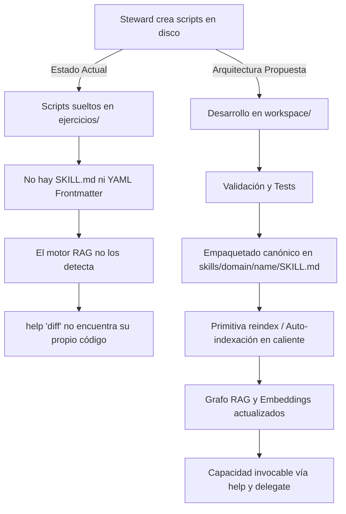
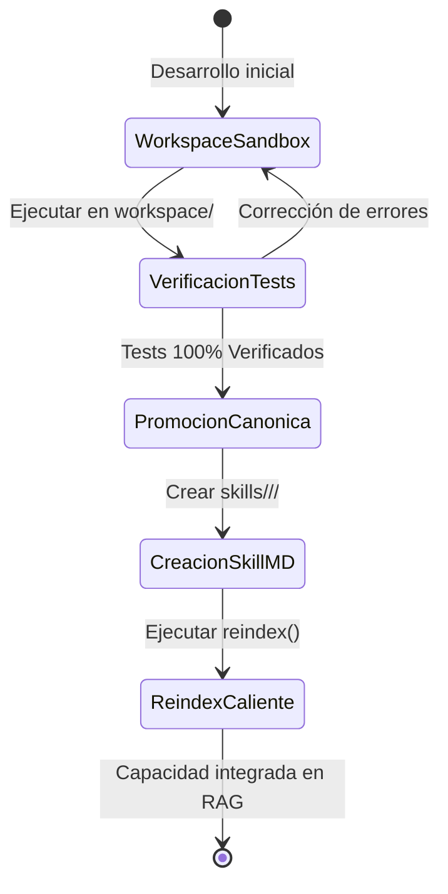
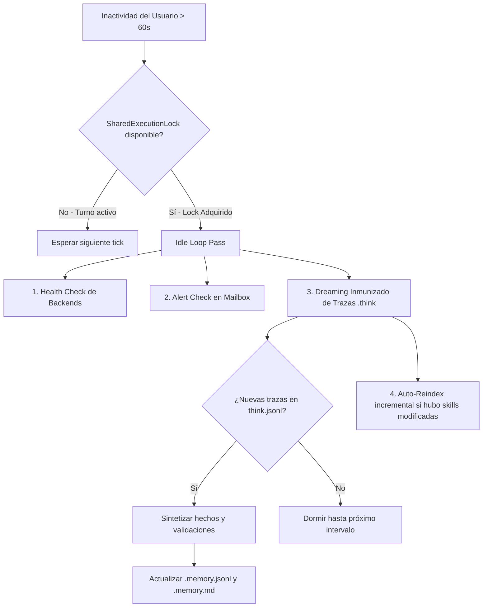

# 🧠 Plan Maestro: Auto-Autoría de Skills, Ciclo RAG en Caliente y Scheduler Autónomo con Dreaming en Inactividad

**Documento:** `plans/autonomous_skills_rag_and_dream_scheduler_plan.md`  
**Fecha:** 2026-08-31  
**Autor:** Antigravity Pairing System (Wingman Agent) & Santiago Javier  
**Objetivo:** Dotar a Tiny Steward de la capacidad de crear sus propias herramientas, empaquetarlas en formato canónico `SKILL.md`, auto-indexarlas en su RAG semántico en caliente, y autogestionar su ciclo de vida con ejecuciones programadas y consolidación de memoria (*dreaming*) durante periodos de inactividad (*idle loop*).

---

## 🎯 Índice de Contenidos

1. [Visión General y Diagnóstico del Estado Actual](#1-visión-general-y-diagnóstico-del-estado-actual)
2. [Pilar 1: Meta-Skill de Autoría de Skills (`skills/_meta/skill_authoring/SKILL.md`)](#2-pilar-1-meta-skill-de-autoría-de-skills)
3. [Pilar 2: Primitiva y Comando de Reindexación en Caliente (`reindex()`, `/reindex`)](#3-pilar-2-primitiva-y-comando-de-reindexación-en-caliente)
4. [Pilar 3: Higiene de Entornos y Promoción (Workspace Sandbox $\to$ Skills Canónicas)](#4-pilar-3-higiene-de-entornos-y-promoción)
5. [Pilar 4: RAG Autónomo y Consolidación con Dreaming en Inactividad (*Idle Loop*)](#5-pilar-4-rag-autónomo-y-consolidación-con-dreaming-en-inactividad)
6. [Pilar 5: Scheduler y Timer Autogestionado para Tareas Autónomas](#6-pilar-5-scheduler-y-timer-autogestionado-para-tareas-autónomas)
7. [Fases de Implementación y Roadmap de Ejecución](#7-fases-de-implementación-y-roadmap-de-ejecución)

---

## 1. Visión General y Diagnóstico del Estado Actual

Tiny Steward ha completado con éxito la creación de 5 herramientas de utilidad de archivos (`file_tree_generator.py`, `diff_visualizer.py`, `config_loader.py`, `checksums.py`, `git_patch_generator.py`) y ha consolidado su memoria de sesión con `/dream` (`facts=5`, `validated=3`, `hypotheses=1`).

Sin embargo, existe una desconexión entre la **generación de código** y la **incorporación de capacidades al motor**:



---

## 2. Pilar 1: Meta-Skill de Autoría de Skills

### 2.1. Propósito
Instruir a Tiny Steward (accesible mediante `help("crear skill")`, `help("skill authoring")`, `help("empaquetar herramienta")`) sobre el contrato estricto de una Skill en Tiny Steward.

### 2.2. Ubicación y Estructura
`skills/_meta/skill_authoring/SKILL.md`

### 2.3. Esquema del Contrato de Skill
```yaml
---
name: nombre-de-la-skill-en-kebab-case
description: Descripción en una o dos frases claras sobre qué hace y cuándo debe usarse.
domain: developer-tools | system | security | automation
subdomain: subcategoría opcional
tags:
  - tag1
  - tag2
  - palabra-clave
version: '1.0'
requires:
  - dependencia_o_herramienta
provides:
  - funcion_exportada_1
  - funcion_exportada_2
---
# Título Humano de la Skill

## Overview
Explicación concisa del propósito de la skill.

## When to Use
Cuándo un agente debe recurrir a esta herramienta o flujo de trabajo.

## Key Capabilities & Tools
Lista de scripts asociados en `scripts/` y cómo ejecutarlos desde Python o Shell.

## Practical Examples
Ejemplos de comandos o llamadas Python con entradas y salidas esperadas.
```

---

## 3. Pilar 2: Primitiva y Comando de Reindexación en Caliente

### 3.1. Diagnóstico
Actualmente `skills/_index.json` y `skills/_index.npy` solo se construyen al iniciar el proceso con `--build-index` o si los archivos no existen en disco.

### 3.2. Especificación Técnica
1. **Primitiva `reindex(path: str = "skills")` en [`core/primitives.py`](file:///c:/Users/soyko/Documents/tiny_steward/core/primitives.py):**
   - Invoca `build_index(skills_root, embedder)` utilizando el embedder atómico configurado.
   - Guarda el JSON y el array de vectores `.npy` atómicamente.
   - Retorna: `{"ok": true, "skills_indexed": int, "index_path": str, "elapsed_sec": float}`.
2. **Comando de REPL `/reindex` en [`steward.py`](file:///c:/Users/soyko/Documents/tiny_steward/steward.py):**
   - Permite al operador humano forzar la recarga del índice en caliente:
     `you > /reindex` $\to$ `✔ Reindexed 2804 skills in 1.4s`.
3. **Actualización de `system_prompt.py` y `TOOLS_SCHEMA`:**
   - Documentar `reindex([path])` dentro de las acciones primitivas disponibles para que el LLM sepa que puede invocarla tras crear o editar un `SKILL.md`.

---

## 4. Pilar 3: Higiene de Entornos y Promoción

### 4.1. Regla de Dos Fases (Sandbox $\to$ Promoción)



1. **Fase 1: Sandbox (`workspace/`)**
   - El código temporal, pruebas intermedias, datos CSV/JSON y scripts experimentales se crean dentro de `workspace/`.
   - Tiny Steward tiene soporte nativo para esto vía el flag `--workspace` y la resolución de rutas en `core/primitives.py`.
2. **Fase 2: Promoción (`skills/`)**
   - Solo cuando un módulo está testeado, tipado y listo para producción, se crea la carpeta en `skills/<categoria>/<slug>/` conteniendo su `SKILL.md` y `scripts/<modulo>.py`.
   - Se ejecuta `reindex()` para registrarlo en el índice.

---

## 5. Pilar 4: RAG Autónomo y Consolidación con Dreaming en Inactividad

### 5.1. El Bucle de Inactividad (*Idle Loop*) y Memoria Profunda

Tiny Steward cuenta con [`core/idle_loop.py`](file:///c:/Users/soyko/Documents/tiny_steward/core/idle_loop.py) gobernado por un semáforo de ejecución compartida (`SharedExecutionLock`). Este sistema garantiza que los procesos en segundo plano nunca compitan por VRAM ni interrumpan los turnos interactivos.



### 5.2. Destilación de Memoria a RAG
- **Vectorización de Hechos Consolidados:** Además de buscar en `skills/`, el RAG puede enriquecerse indexando los hechos (`facts`) consolidados en `sessions/<session>.memory.jsonl`, permitiendo que sesiones cruzadas recuerden soluciones a errores previos o configuraciones específicas del entorno.

---

## 6. Pilar 5: Scheduler y Timer Autogestionado para Tareas Autónomas

### 6.1. Propósito
Permitir que Tiny Steward programe tareas recurrentes o temporizadas (ej. revisiones de higiene de código, backups incrementales, reindexación nocturna, monitorización de logs de backend) de forma autónoma.

### 6.2. Arquitectura del Scheduler (`core/scheduler.py`)

```python
@dataclass
class ScheduledJob:
    job_id: str
    cron_or_interval_sec: float
    task_statement: str
    lane: str = "atomic"          # "atomic" | "orchestrator"
    last_run_ts: float = 0.0
    enabled: bool = True
    max_runs: int | None = None
    runs_count: int = 0
```

1. **Acción `schedule(task: str, interval_sec: int, lane: str = "atomic")`:**
   - Permite al LLM registrar una tarea autónoma diferida.
2. **Ejecución en Idle:**
   - El `IdleLoop` inspecciona los trabajos pendientes en cada tick y ejecuta las tareas debidas utilizando `SharedExecutionLock.hold_idle()`.
3. **Registro Duradero:**
   - Las tareas programadas se persisten en `sessions/<session>/schedules.json` para sobrevivir a reinicios de la sesión.

---

## 7. Fases de Implementación y Roadmap de Ejecución

### Fase 1: Meta-Skill de Autoría y Primitiva `reindex()`
- `[NEW]` `skills/_meta/skill_authoring/SKILL.md`: Documento canónico de creación de skills.
- `[MODIFY]` `core/primitives.py`: Implementar función `reindex(path="skills")`.
- `[MODIFY]` `steward.py`: Añadir comando REPL `/reindex`.
- `[MODIFY]` `core/system_prompt.py`: Exponer `reindex([path])` en las acciones disponibles.
- `[NEW]` `tests/test_reindex_primitive.py`: Pruebas automatizadas de reindexación en caliente.

### Fase 2: Promoción de las 5 Herramientas de Archivo a Skills Canónicas
- Crear `skills/file_utilities/`:
  - `directory-tree-generator/` (`SKILL.md` + `scripts/file_tree_generator.py`)
  - `diff-visualizer/` (`SKILL.md` + `scripts/diff_visualizer.py`)
  - `config-loader/` (`SKILL.md` + `scripts/config_loader.py`)
  - `checksums-verifier/` (`SKILL.md` + `scripts/checksums.py`)
  - `git-patch-manager/` (`SKILL.md` + `scripts/git_patch_generator.py`)
- Ejecutar `reindex()` y verificar la detección semántica con consultas a `help()`.

### Fase 3: Integración del Scheduler Autogestionado en `IdleLoop`
- `[NEW]` `core/scheduler.py`: Motor de gestión de trabajos diferidos y periódicos.
- `[MODIFY]` `core/idle_loop.py`: Conectar el ejecutor de tareas programadas dentro de los ticks de inactividad.
- `[NEW]` `tests/test_scheduler_idle.py`: Validar la ejecución en segundo plano sin colisión de locks.
