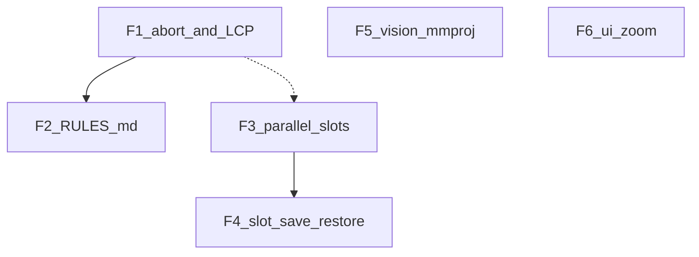

# Fuera de alcance → siguiente ciclo (F1+)

**Origen:** diferidos del plan multiphase + post P0–P8.  
**Referencia:** [`referencia-delegate-panes-mailbox.md`](referencia-delegate-panes-mailbox.md)  
**Ciclo anterior (cerrado):** [`proximo-trabajo.md`](proximo-trabajo.md)

P0–P8 están **hechos**. Este archivo es el backlog ejecutable siguiente.



---

## Verificación previa (2026-07-16)

| Check | Resultado |
|-------|-----------|
| `python -m unittest discover -s tests` | 60 OK |
| OpenClaw leaks en `discover_skills(skills/)` | 0 |
| `_meta/primitives` + troubleshooting indexados | 15 |
| `config.yaml` orch `enable_thinking` / atomic | `true` / `false` |

Pendiente operativo (humano): `python steward.py --build-index` para regenerar embeddings sin packs OpenClaw.

---

## Orden

1. **F1** — Abort mid-generation + LCP (`timings.cache_n`) en stats  
2. **F2** — `RULES.md` global como system prefix  
3. **F3** — `--parallel N` + `id_slot` por child (ops + cliente)  
4. **F4** — Slot save/restore unificado con árbol de sesiones  
5. **F5** — Vision / mmproj (camino mínimo)  
6. **F6** — Zoom de fuente por emulador (bajo ROI)

---

## F1 — Abort mid-stream + LCP metrics

### Abort
- Durante `_stream_response`, `Ctrl+C` cierra el HTTP stream (libera slot llama.cpp) y **no** sale del REPL.
- Devolver respuesta parcial marcada; avisar en display.
- Documentar en `core/README.md` (reemplaza “abort not used”).

### LCP
- Parsear `timings` del chunk final de llama-server (`cache_n`, `prompt_n`, `predicted_n`).
- Mostrar en la línea de stats: `LCP cache_n/(cache_n+prompt_n)`.
- Extender `TurnStats` + tests con mock de chunk timings.

### Archivos
- `core/llm.py`, `core/runtime.py`, `core/stats.py`, `core/display.py`, `core/README.md`, tests

---

## F2 — RULES.md global ✅

- Si existe `RULES.md` (repo root o `sessions/RULES.md`), inyectarlo tras `SYSTEM_PROMPT` en sesiones nuevas.
- No migrar historiales viejos (eso sigue diferido).
- Plantilla humana: `sessions/template-review.md` es referencia, no enforcement.
- Config: `rules.enabled` / `rules.path`. REPL: `/rules`, `/rules reload`.
- Archivos retirados documentados en [`archivos-retirados.md`](archivos-retirados.md).

---

## F3 — Parallel slots + id_slot

- Ops: subir `--parallel N` en atomic (y orch si aplica) — **cambio de host**, documentar en config.
- Cliente: pin `id_slot` por child session cuando `N>1`.
- Sin esto, children siguen serializando en un solo slot.

---

## F4 — Slot save/restore

- `--slot-save-path` + `POST /slots/{id}?action=save|restore|erase`
- Unificar con metadata parent→children de Steward.
- `n_keep` / ctx-shift: nota ops; no UI nueva.

---

## F5 — Vision (Qwythos multimodal)

Requiere GGUF texto + `mmproj-*.gguf`.

```bash
llama-mtmd-cli \
  -m Qwythos-9B-Claude-Mythos-5-1M-Q4_K_M.gguf \
  --mmproj mmproj-Qwythos-9B-Claude-Mythos-5-1M-F16.gguf \
  --image ./photo.jpg \
  -p "Describe this image in detail." \
  --temp 0.6 --top-p 0.95 --top-k 20 \
  -c 16384

llama-server \
  -m Qwythos-9B-Claude-Mythos-5-1M-Q4_K_M.gguf \
  --mmproj mmproj-Qwythos-9B-Claude-Mythos-5-1M-F16.gguf \
  -c 16384 --port 8080
```

Camino mínimo Steward: mensaje multimodal (path → base64), `add_vision_id` solo con imagen, sin rediseñar REPL.

---

## F6 — Zoom / sampling UI (bajo ROI)

- Zoom por emulador (`kitty --override`, Alacritty, WezTerm).
- Sampling avanzado (mirostat, dry, xtc) ya cabe en `extra_params` — sin UI nueva.

---

## Diferidos explícitos (no numerados)

- Migrar historiales de sesión a schema nuevo
- Abort “stop ya” como meta-comando `/stop` (F1 cubre Ctrl+C; `/stop` opcional después)

---

## Checklist

- [x] f1-abort-lcp  
- [x] f2-rules-md  
- [ ] f3-parallel-id-slot  
- [ ] f4-slot-save-restore  
- [ ] f5-vision-mmproj  
- [ ] f6-font-zoom  
