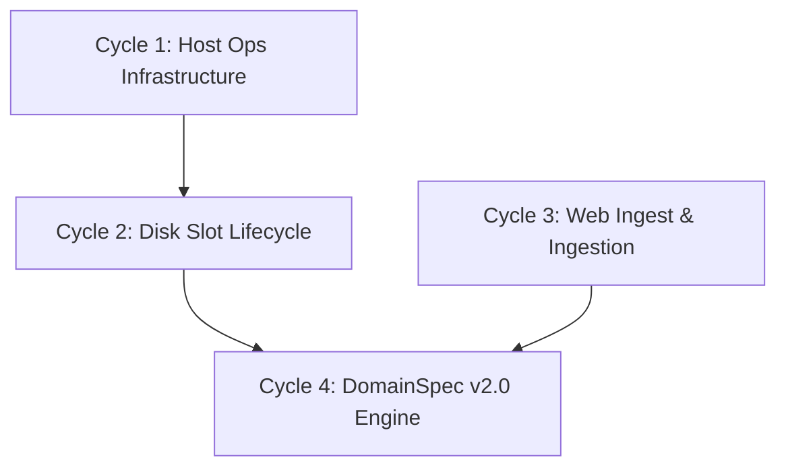

# Unified Roadmap & Backlog (F1+)

**Source:** Consolidated backlog from P0–P8, F1–F7 cycles, and DomainSpec/understand-anything integrations.  
**Historical Archives:** [`archive/`](archive/)  
**Operator Guide:** [`docs/operator.md`](../docs/operator.md)  
**Retirements:** [`archivos-retirados.md`](archivos-retirados.md)

---

## 🏆 Completed Milestones (F1–F7 & Infrastructure)

- **F1–F2: LCP Abort & Global Rules**
  - Tool-call parser tolerates hybrid parameters (`<parameter=name>` / bare `<path>`).
  - System prompt loads global rules from `RULES.md` with soft size truncation.
- **F3–F5 (Client-side): Concurrency, Slots, & Multimodal Vision**
  - Pinning for orchestrator (`id_slot: 0`) and automatic fallback (`id_slot: -1`) for atomic actions.
  - Verification of `/props` on lane startup and `/backend props` preview.
  - Image attachment support (via `/attach`, `@path`, `/image`) translated to base64 OpenAI `image_url` parts.
- **F7: Prompt Hygiene & dreaming**
  - Inbound filtering to reject pasted console chrome; outbound scrub of empty assistants.
  - Client-side execution semaphore (`backends.gate`) separating orchestrator, atomic, and embedding lanes.
  - `/dream` and `/memory` commands to consolidate session think files (`*.think.jsonl`) into markdown (`*.memory.md`).
- **Runtime Restructuring & Swappable Providers**
  - Decoupled Qwythos and Qwen JSON chat parsers into standalone `ProviderProfile` objects.
  - Split the 2000+ line `runtime.py` into specialized mixin modules (`runtime_meta`, `runtime_delegate`, `runtime_messages`).
- **Cyber Skills Classification & Topic Layout**
  - Cataloged ~831 security skills into a topic-primary folder structure (`skills/<topic>/<slug>`), with verbs retained as metadata in a CSV mapping (`domainspec_mapping.csv`).

---

## 🗺️ Unified Roadmap: Next Cycles

### 🌀 Cycle 1: Host Ops Infrastructure (F3 + F5 Host)
Configure multi-slot concurrency and vision on the host llama-server.
- **Tasks**:
  - Configure multi-slot server instances on the host side (raising `--parallel N` in llamacpp launch scripts).
  - Explicitly set `--cache-ram` and `--cache-idle-slots` on host launch.
  - Set up mmproj GGUF on the host and launch orchestrator with `-WithVision` as the default operational state.
- **Dependencies**: None.

### 🌀 Cycle 2: Disk Slot Lifecycle (F4 Host)
Configure slots persistence on disk via the server's slot API.
- **Tasks**:
  - Implement host-side slot save/restore actions (`--slot-save-path` and `/slots/{id}?action=save|restore`).
  - Wire Steward metadata (`orch_id_slot`) to automatically trigger slot recycling on host endpoints.
- **Dependencies**: Cycle 1 (host multi-slot execution must be active).

### 🌀 Cycle 3: Interactive & Web Ingest MVP (F8)
Provide structured HTML retrieval for reading documentation.
- **Tasks**:
  - Enhance `http` tool with a plain-text HTML parser (HTML→text converter) to ingest web documentation.
  - Implement a basic Playwright or browser-control subagent (or MCP) for targeted web UI actions under context constraints (e.g. without loading heavy browser frames).
- **Dependencies**: None.

### 🌀 Cycle 4: DomainSpec v2.0 Engine & Progressive Loader
Move from static text rules to dynamic progressive skill composition.
- **Tasks**:
  - Implement a parser in `tiny_steward` that reads DomainSpec v2.0 `.domain.md` and `.policy.md` files (validating against `domainspec.schema.json`).
  - Build the OpenClaw progressive loader runtime to dynamically load/evict domains based on action lifecycle hooks and context budgets.
  - Migrate the cyber skills topic directories into formal DomainSpec v2.0 nodes.
- **Dependencies**: Cycle 2 (for saving slot states across progressive loads).

---

## 📋 Remaining Backlog Checklist

- [x] F1-abort-lcp
- [x] F2-rules-md
- [x] Tool-call-write-hardening + attach-by-path + think-nudge + operator docs
- [x] F7-prompt-hygiene-gate-dreaming
- [x] F3-parallel-id-slot *(Client-side done; Host-side `--parallel` pending)*
- [x] F4-slot-save-restore *(Client-side done; Host-side `/slots` API pending)*
- [x] F5-vision-mmproj *(Client-side done; Host `-WithVision` setup pending)*
- [ ] F6-font-zoom *(Low priority font magnification per terminal)*
- [ ] F8-web-browser *(Cycle 3)*
- [ ] DomainSpec-v2-Engine *(Cycle 4)*
