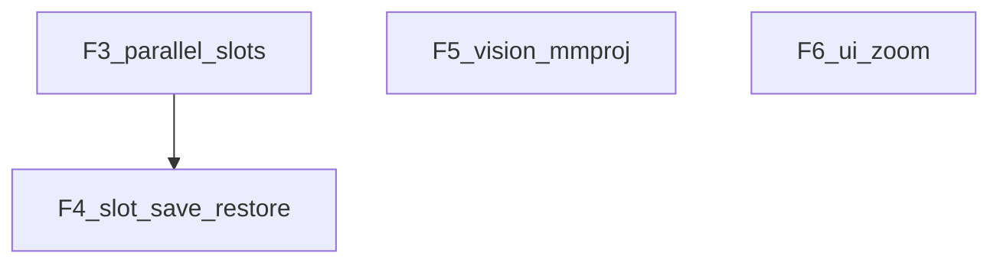

# Fuera de alcance → siguiente ciclo (F1+)

**Origen:** diferidos del plan multiphase + post P0–P8.  
**Archivo histórico:** [`archive/`](archive/)  
**Operador:** [`docs/operator.md`](../docs/operator.md)  
**Retiros:** [`archivos-retirados.md`](archivos-retirados.md)

P0–P8 y F1–F2 **hechos**. También (2026-07-16 noche):

- Parser tolera `<path>` / hybrid `</parameter>`; ejemplo `write` en SYSTEM_PROMPT
- `/attach` + `@path` para transcripts largos (sin pegar)
- Nudge si solo hay think sin tool_call
- Skills `_meta/primitives` en formato `<tool_call>`
- `sessions/` untracked; playbook de operador

**F7 (2026-07-17) hecho:**

- Prompt hygiene: refuse pasted REPL chrome; scrub outbound; empty think-only placeholder
- Client `backends.gate` for orch/atomic/embed (interactive > dream)
- `/dream` + `/memory` → `*.memory.jsonl` / `*.memory.md`; compact prefers memories

**F3 parcial (2026-07-17) — cliente sí, host no:**

- `llm.orchestrator.id_slot: 0` enviado en el body; atomic sin clave (default server `-1`)
- `GET /props` check al arranque; `llm.*.launch` + `/backend`; gate sin cambios
- **Launcher F3 knobs:** `launch.parallel` → `-Parallel N`, `profile`/`context`, `expect_total_slots` verificado post-start vía `/props`; `/backend props <lane>`
- `cache_ram` / `cache_idle_slots` / `slot_save_path` = anotaciones hasta que los scripts host las acepten (`extra_args`)
- **Host `--parallel N` real sigue siendo ops** (editar/lanzar scripts en `llamacpp`) → F4 disk-slot API sigue bloqueado (`f3 --> f4`)
- Condiciones de arranque host: [`docs/operator.md`](../docs/operator.md) § F3 / `/backend`

**F4 parcial (2026-07-17) — alcance aclarado + metadata; no KV client:**

- llama.cpp ya hace longest-prefix/LRU + prompt-cache; Steward **no** reimplementa slots/KV
- Árbol de sesiones ya existe (`/tree`, `metadata.parent|children`)
- Cliente: `metadata.orch_id_slot` se sella desde `llm.orchestrator.id_slot` (visible en `/tree`)
- Persistencia KV a disco (`--slot-save-path` + `/slots/{id}?action=…`) = **ops host**, pendiente de F3 `--parallel`
- Steward solo anota `launch.slot_save_path` en `/backend props` — **no** llama `POST /slots`
- “Restore” Steward = `/session <name>` + LCP servidor

**Provider profiles (adyacente, 2026-07-17):**

- `llm.*.provider` en `config.yaml`; Runtime resuelve perfiles; `/providers` en REPL
- Mixins `runtime_meta` / `runtime_delegate` ya extraídos
- Evals/fixtures: `evals/providers/{qwythos,qwen3_json}/` + `tests/test_provider_evals.py` (hecho)

**F5 (2026-07-17) — cliente hecho; host mmproj opcional:**

- Probe `GET /v1/models` multimodal → `runtime.vision_enabled`; config `llm.orchestrator.vision: auto|on|off`
- `/image`, `/attach` image, `@png` → OpenAI `image_url` data-URI; session stores path refs
- Atomic text-only (images stripped); refuse with actionable error if vision off
- **Ops:** restart orch with `-WithVision` / `--mmproj` before expecting grounded answers (see operator.md)

---

## Orden restante

1. **F3 host** — subir `--parallel N` + pins opcionales por child (ops) — cliente ya parcial  
2. **F4** — Disk slot save/restore (host) cuando F3 multi-slot exista; Steward ya tiene árbol + pin metadata  
3. **F6** — Zoom de fuente por emulador (bajo ROI)  
4. **F8** — Web/browser ingest (deferred; not vision)

---

## Checklist

- [x] f1-abort-lcp  
- [x] f2-rules-md  
- [x] tool-call-write-hardening + attach-by-path + think-nudge + operator docs  
- [x] f7-prompt-hygiene-gate-dreaming  
- [x] f3-parallel-id-slot *(parcial: cliente `id_slot` orch; host `--parallel` pendiente)*  
- [x] f4-slot-save-restore *(parcial: alcance + `orch_id_slot` metadata + docs; disk `/slots` host pendiente)*  
- [x] f5-vision-mmproj *(cliente; host `-WithVision` es ops)*  
- [ ] f6-font-zoom  
- [ ] f8-web-browser *(deferred)*  
