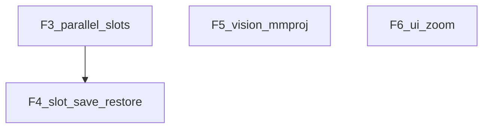

# Fuera de alcance → siguiente ciclo (F1+)

**Origen:** diferidos del plan multiphase + post P0–P8.  
**Archivo histórico:** [`archive/`](archive/)  
**Operador:** [`docs/operator.md`](../docs/operator.md)  
**Retiros:** [`archivos-retirados.md`](archivos-retirados.md)

P0–P8 y F1–F2 **hechos**. También (2026-07-16 noche):

- Parser tolera `<path>` / hybrid `</parameter>`; ejemplo `write` en SYSTEM_PROMPT
- `/attach` + `@path` para transcripts largos (sin pegar)
- Nudge si solo hay think sin tool_call
- Skills `_meta/primitives` en formato `<tool_call>`
- `sessions/` untracked; playbook de operador

---

## Orden restante

1. **F3** — `--parallel N` + `id_slot` por child (ops host + cliente)  
2. **F4** — Slot save/restore unificado con árbol de sesiones  
3. **F5** — Vision / mmproj (camino mínimo)  
4. **F6** — Zoom de fuente por emulador (bajo ROI)

---

## Checklist

- [x] f1-abort-lcp  
- [x] f2-rules-md  
- [x] tool-call-write-hardening + attach-by-path + think-nudge + operator docs  
- [ ] f3-parallel-id-slot  
- [ ] f4-slot-save-restore  
- [ ] f5-vision-mmproj  
- [ ] f6-font-zoom  
