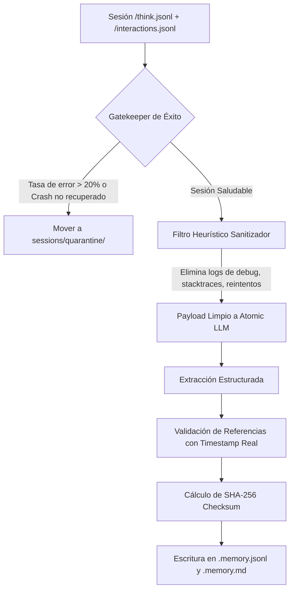
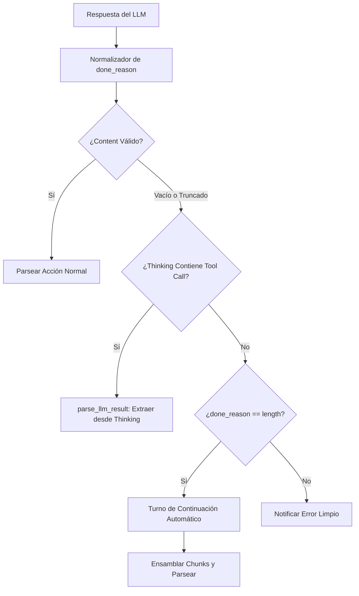

# 🏗️ Planes de Implementación Detallados: Evolución y Resiliencia de Tiny Steward

**Documento:** `plans/master_architecture_improvement_plan.md`  
**Fecha:** 2026-08-30  
**Autor:** Antigravity Pairing System (Wingman Agent)  
**Backend de Pruebas Activo:** Docker `ollama-planner` (`http://localhost:11434`, Qwen 3.8 / Qwythos 9B).

---

## 🎯 Tabla de Contenidos

1. [[P0] Inmunización de `/dream` y Memoria Persistente](#1-p0-inmunización-de-dream-y-memoria-persistente)
2. [[P0] Guardarraíles de Truncación y Agotamiento de Reasoning en `core/llm.py`](#2-p0-guardarraíles-de-truncación-y-agotamiento-de-reasoning-en-corellmpy)
3. [[P1] Extracción de `StewardEngine` (Kernel de Servicio Unificado)](#3-p1-extracción-de-stewardengine-kernel-de-servicio-unificado)
4. [[P1] Servidor FastMCP para Tiny Steward (`mcp_server/`)](#4-p1-servidor-fastmcp-para-tiny-steward-mcp_server)
5. [[P2] Contrato `finding.schema.json` y Validador de Fases](#5-p2-contrato-findingschemajson-y-validador-de-fases)
6. [Plan de Pruebas Integradas con `ollama-planner`](#6-plan-de-pruebas-integradas-con-ollama-planner)

---

## 1. [P0] Inmunización de `/dream` y Memoria Persistente

### 1.1. Contexto y Diagnóstico
En `core/dreaming.py`, el comando `/dream` recopila las trazas de pensamiento (`.think.jsonl`) y las sintetiza usando el LLM atómico. Sin embargo, no verifica si la sesión contuvo fallos críticos, excepciones en cascada, o si las acciones ejecutadas tuvieron éxito. Si una sesión se desvió o alucinó, `/dream` consolida esas asunciones como hechos (`facts`) en `sessions/<name>.memory.jsonl` y `sessions/<name>.memory.md`.

### 1.2. Arquitectura de Inmunización (5 Pilares)



### 1.3. Especificación Técnica

#### Archivos Afectados
- `[MODIFY]` `core/dreaming.py`
- `[NEW]` `tests/test_dream_immunization.py`

#### Cambios Concretos
1. **Filtro de Salud de Sesión (`assess_session_health`)**:
   ```python
   def assess_session_health(interactions_path: Path) -> dict[str, Any]:
       # Analiza interacciones, detecta errores de shell y caídas de herramientas.
       # Retorna: {"healthy": bool, "error_rate": float, "failed_actions": int}
   ```
2. **Aislamiento en Cuarentena**:
   Si la sesión no es saludable, `/dream` emite un aviso, marca el estado como `quarantined` y guarda el resultado en `sessions/quarantine/<name>.memory.quarantine.jsonl`.
3. **Filtro Heurístico de Ruido (`clean_trace_content`)**:
   Elimina patrones como `Traceback (most recent call last)`, `Remediated issue:`, `[aborted]`, comandos repetidos en bucle y salidas de error crudas.
4. **Integridad Criptográfica (SHA-256)**:
   Almacena un `manifest` con `source_think_sha256` y `memory_sha256` para evitar que modificaciones manuales corrompan el índice.

---

## 2. [P0] Guardarraíles de Truncación y Agotamiento de Reasoning en `core/llm.py`

### 2.1. Contexto y Diagnóstico
1. **Thinking Exhaustion**: Qwythos / Qwen 3.8 a veces consume todo el presupuesto de `max_tokens` dentro de `<think>...</think>`, devolviendo un mensaje con `content` vacío o cortado, pero con la herramienta ya definida en el bloque de pensamiento.
2. **Disparidad de Endpoints**: Ollama nativo entrega `done_reason`, mientras que OpenAI compatible entrega `finish_reason`.
3. **Truncación Dura**: Cuando `done_reason == "length"`, la acción queda con etiquetas XML/JSON incompletas (e.g. `<parameter=content>texto incom...`).

### 2.2. Arquitectura de Resiliencia



### 2.3. Especificación Técnica

#### Archivos Afectados
- `[MODIFY]` `core/llm.py`
- `[MODIFY]` `core/action_parse.py`
- `[NEW]` `tests/test_llm_truncation_guards.py`

#### Cambios Concretos
1. **Función `parse_llm_result(content: str, thinking: str) -> tuple[dict, str | None]`**:
   - Intenta primero parsear `content`.
   - Si falla y `thinking` tiene un bloque `<tool_call>` o `<function=...>`, rescata la invocación directamente del pensamiento.
2. **Normalización Unificada de `done_reason`**:
   - Mapear `finish_reason` de OpenAI ("stop" $\to$ "stop", "length" $\to$ "length") a un campo de primer nivel `result["done_reason"]`.
3. **Turno de Continuación (`chat_continue`)**:
   - En `core/runtime_loop.py` / `core/runtime_execution.py`, si se detecta `done_reason == "length"` y un XML/JSON sin cerrar, ejecutar una solicitud de continuación:
     `"Continue the XML/JSON tool call exactly from where you stopped. Output only the continuation."`
     y concatenar antes de ejecutar.

---

## 3. [P1] Extracción de `StewardEngine` (Kernel de Servicio Unificado)

### 3.1. Contexto y Diagnóstico
Actualmente `steward.py` mezcla el bucle interactivo de terminal (Rich, PromptToolkit) con la lógica interna de ejecución de acciones, carga de extensiones, manejo de sesiones y llamadas al LLM.

### 3.2. Arquitectura del Kernel Unificado

```
┌────────────────────────────────────────────────────────────────┐
│                        Superficies CLI/API                     │
│   steward.py (REPL)  │  mcp_server/  │  serve.py (Web/WS)      │
└───────────────────────────────┬────────────────────────────────┘
                                │ consume
                                ▼
┌────────────────────────────────────────────────────────────────┐
│               core/service_kernel.py (StewardEngine)           │
│  - init_session(name, model, profile)                          │
│  - step(session_name, user_input, stream_cb) -> TurnResult     │
│  - execute_action(action_dict) -> ActionResult                 │
│  - dream(session_name) -> DreamResult                          │
│  - query_skills(query, domain) -> list[SkillMatch]             │
│  - delegate_task(task, lane) -> DelegateResult                 │
└───────────────────────────────┬────────────────────────────────┘
                                │ orquesta
                                ▼
┌────────────────────────────────────────────────────────────────┐
│                    Componentes del Runtime                     │
│  RuntimeLoop │ ActionExecutor │ SessionStore │ Mailbox │ Gate  │
└────────────────────────────────────────────────────────────────┘
```

### 3.3. Especificación Técnica

#### Archivos Afectados
- `[NEW]` `core/service_kernel.py`
- `[MODIFY]` `steward.py` (pasa a ser un consumidor delgado)
- `[MODIFY]` `serve.py` (utiliza `StewardEngine` directamente)
- `[NEW]` `tests/test_service_kernel.py`

#### Dataclasses Principales
```python
@dataclass
class TurnResult:
    session_name: str
    response_text: str
    actions_executed: list[dict[str, Any]]
    thinking: str
    done_reason: str
    tokens_used: int
    success: bool
```

---

## 4. [P1] Servidor FastMCP para Tiny Steward (`mcp_server/`)

### 4.1. Contexto y Diagnóstico
Permitir que agentes externos (Antigravity IDE, Claude Desktop, otros subagentes) utilicen Tiny Steward como un conjunto de herramientas estandarizado mediante Model Context Protocol (MCP).

### 4.2. Especificación Técnica

#### Archivos Afectados
- `[NEW]` `mcp_server/__init__.py`
- `[NEW]` `mcp_server/server.py`
- `[NEW]` `mcp_server/claude_desktop_config.json`
- `[NEW]` `tests/test_mcp_server.py`

#### Herramientas MCP a Exponer
1. `steward_chat(session_name: str, message: str) -> str`: Ejecuta un turno conversacional.
2. `steward_execute_task(task: str, timeout_sec: int = 120) -> dict`: Tarea autónoma acotada.
3. `steward_dream(session_name: str) -> dict`: Dispara consolidación de memoria.
4. `steward_lookup_skills(query: str, domain: str = "") -> list[dict]`: Búsqueda semántica en el grafo de skills.
5. `steward_read_memory(session_name: str) -> str`: Lee hechos y validaciones consolidadas.
6. `steward_delegate(task: str, lane: str = "atomic") -> dict`: Lanza un subagente delegado.

---

## 5. [P2] Contrato `finding.schema.json` y Validador de Fases

### 5.1. Contexto y Diagnóstico
Sustituir revisiones de código y salidas de error en texto libre por un contrato JSON estricto con acciones correctivas aplicables por agentes (`suggested_fix`).

### 5.2. Especificación Técnica

#### Archivos Afectados
- `[NEW]` `DomainSpec/finding.schema.json`
- `[NEW]` `core/phase_evaluator.py`
- `[NEW]` `tests/test_phase_evaluator.py`

#### Estructura del Esquema `Finding`
```json
{
  "rule_id": "code.syntax.unbalanced_brackets",
  "domain": "code",
  "severity": "critical",
  "refs": [{"file": "core/sample.py", "line": 42}],
  "message": "Falta cerrar paréntesis en la definición de la función",
  "suggested_fix": {
    "action": "replace_line",
    "details": {"line": 42, "replacement": "def test():"}
  },
  "confidence": 1.0
}
```

---

## 6. Plan de Pruebas Integradas con `ollama-planner`

### 6.1. Configuración de Entorno de Pruebas
- **Endpoint Activo**: `http://localhost:11434`
- **Modelo Activo**: `qwythos-9b-96k:latest` / Qwen 3.8 9B
- **Pruebas a Ejecutar**:
  1. `pytest tests/test_llm_truncation_guards.py` (con mocks + live check opcional).
  2. `pytest tests/test_dream_immunization.py` (con fixtures de sesiones fallidas y limpias).
  3. `pytest tests/test_service_kernel.py` (verificando ejecución headless).
  4. `pytest tests/test_mcp_server.py` (invocación de herramientas FastMCP).
  5. `pytest tests/test_phase_evaluator.py` (verificación de reglas y esquemas).
