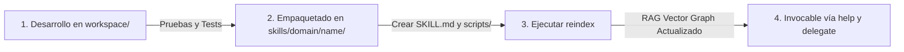

# Skill Authoring & Extension Standard for Tiny Steward

This skill defines the canonical lifecycle, folder conventions, YAML frontmatter contract, and registration procedure for creating new skills in Tiny Steward.

---

## 1. Skill Architecture Overview

A **Skill** is a discoverable unit of capability in Tiny Steward. Each skill is packaged as a markdown document with structured YAML frontmatter, optionally accompanied by executable Python scripts, CLI wrappers, or domain references.

```text
skills/
└── <domain>/
    └── <skill-slug>/
        ├── SKILL.md                 # Required: metadata + documentation
        ├── scripts/                 # Optional: standalone Python / shell scripts
        │   └── tool_logic.py
        └── references/              # Optional: cheatsheets, API specs, guidelines
            └── standards.md
```

---

## 2. The `SKILL.md` Contract (YAML Frontmatter)

Every skill **MUST** start with a valid YAML frontmatter block enclosed between `---` delimiters at the very top of `SKILL.md`:

```markdown
---
name: slug-en-kebab-case
description: Breve descripción en 1-2 frases del propósito de la skill y cuándo usarla.
domain: developer-tools | security | system | automation | policy
subdomain: subcategoría opcional
tags:
  - palabra-clave-1
  - palabra-clave-2
  - nombre-herramienta
version: '1.0'
requires:
  - dependencia_o_herramienta
provides:
  - funcion_o_capacidad_exportada_1
  - funcion_o_capacidad_exportada_2
---
# Título Humano de la Skill

## Overview
Explicación detallada pero concisa del problema que resuelve y las capacidades que aporta.

## When to Use
Escenarios claros donde el agente o el usuario deben activar o consultar esta skill.

## Key Capabilities & Tools
Descripción de los scripts incluidos en `scripts/` y cómo ejecutarlos desde Python o Shell.

## Practical Examples
Ejemplos de comandos shell o llamadas Python con entradas y salidas esperadas.
```

---

## 3. Mandatory Fields Reference

| Campo | Tipo | Obligatorio | Descripción |
| :--- | :--- | :--- | :--- |
| `name` | String | Sí | Identificador único en formato kebab-case (ej. `diff-visualizer`). |
| `description` | String | Sí | Frase de resumen de alto impacto. El RAG la utiliza para calcular embeddings semánticos. |
| `domain` | String | Sí | Categoría principal (`developer-tools`, `security`, `system`, `astrophotography`, etc.). |
| `tags` | List[str] | Sí | Palabras clave para coincidencia léxica y búsqueda vectorial enriquecida. |
| `provides` | List[str] | No | Funciones, clases o comandos que expone la skill. |
| `requires` | List[str] | No | Dependencias requeridas (librerías Python, binarios del sistema). |

---

## 4. Lifecycle: De Desarrollo a Skill Canónica



1. **Fase de Desarrollo (Sandbox):**
   - Escribe y prueba el código en `workspace/` (ej. `workspace/mi_herramienta.py`).
   - Verifica su correcto funcionamiento con `python` o `pwsh`.

2. **Fase de Promoción (Canónica):**
   - Crea el directorio `skills/<domain>/<skill-slug>/`.
   - Crea `skills/<domain>/<skill-slug>/SKILL.md` con el frontmatter YAML canónico.
   - Mueve el script limpio a `skills/<domain>/<skill-slug>/scripts/<herramienta>.py`.

3. **Fase de Indexación en Caliente:**
   - Ejecuta la acción primitiva `reindex()` o el comando `/reindex`:
     ```xml
     <tool_call>
     <function=reindex>
     <parameter=path>skills</parameter>
     </function>
     </tool_call>
     ```
   - Tiny Steward reconstruirá `skills/_index.json` y `skills/_index.npy` inmediatamente.

4. **Verificación:**
   - Comprueba la integración semántica invocando:
     ```xml
     <tool_call>
     <function=help>
     <parameter=query>mi nueva herramienta</parameter>
     </function>
     </tool_call>
     ```
